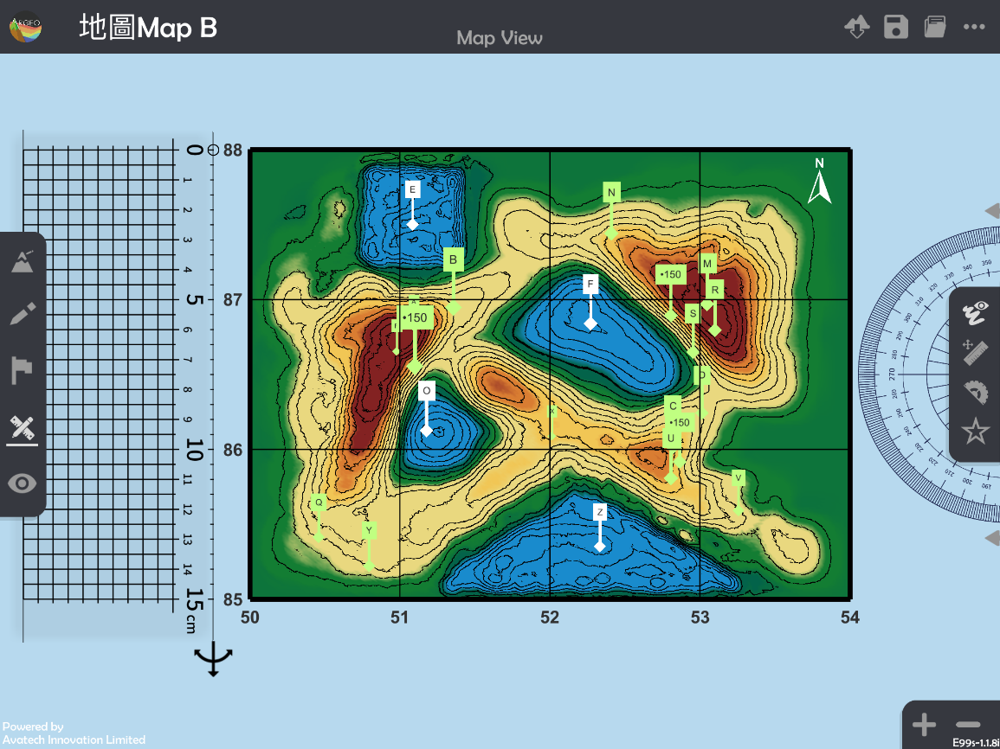
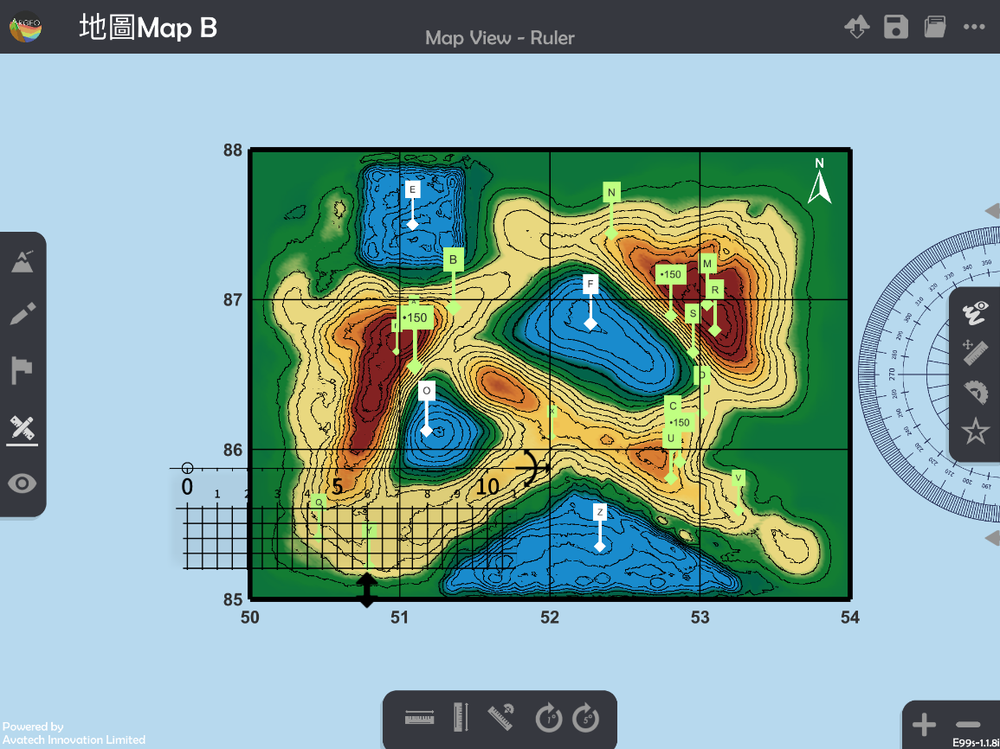
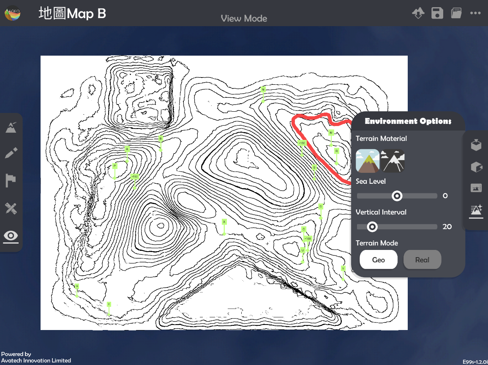
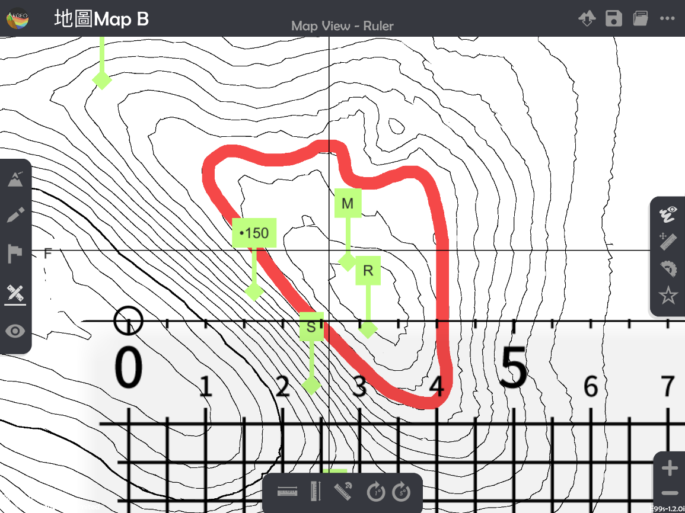
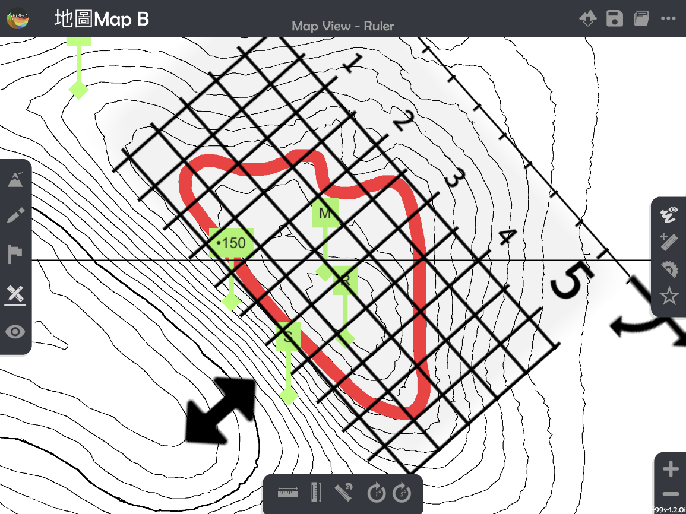
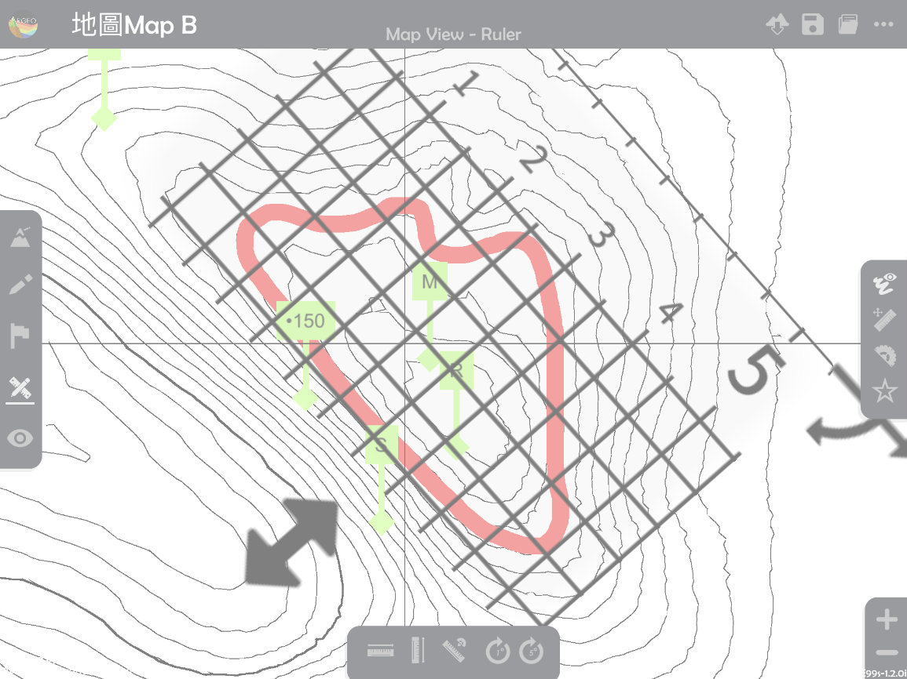

Area
===================================

.. |preset_terrain| image:: area_images/preset_terrain.png
   :width: 30

.. |terrain_edit_mode| image:: area_images/terrain_edit_mode.png
   :width: 30

.. |mapview| image:: area_images/mapview.png
   :width: 30

.. |get_ruler| image:: area_images/get_ruler.png
   :width: 30

.. |vertical_ruler| image:: area_images/vertical_ruler.png
   :width: 30

.. |pen| image:: area_images/pen.png
   :width: 30

.. |viewmode| image:: area_images/viewmode.png
   :width: 30

.. |black_white| image:: area_images/black_white.png
   :width: 30

.. |get_ruler| image:: area_images/get_ruler.png
   :width: 30

Teaching Demonstration
*********

The following demonstration shows the teaching procedures of Area by using ARGEO Portable.

**Calculate the actual area of regular-shape object.**

a. Select a“Preset Terrain |preset_terrain|”or use“Terrain Modifying |terrain_edit_mode|”function to form a terrain. The following example is to calculate the actual area of Pond E in “地圖Map B Preset Terrain”

b. Apply “Map View |mapview|".

c. Apply “Get Ruler |get_ruler|”.

d. Place and adjust the ruler.

   * “Horizontal Ruler |horizontal_ruler|” and “Vertical Ruler |vertical_ruler|” can be applied to adjust the ruler to horizontal or vertical. 

   * “Enlarge” and “Reduce” can be applied to adjust the “Map view” to reduce the measurement error. 

.. image:: area_images/area4.png
  :width: 600
  :alt: Login Screen

e. Calculate the actual area.

**Calculate the actual area of irregular-shape object.**

a. Select a “Preset Terrain |preset_terrain|” or use “Terrain Modifying |terrain_edit_mode|” function to form a terrain. The following example is to calculate the actual area of hill, which in dark brown colour in grid squares 5286, 5287, 5386, and 5387.

b. Apply “Map View |mapview|".

.. image:: area_images/area6.png
  :width: 600
  :alt: Login Screen

c. elect “Drawing Tools |pen|” and sketch the outline of the area which needs to be measured. 

*White colour is NOT suggested to use in sketching as it will be difficult to calculate the area in the following steps.

*“Enlarge” and “Reduce” can be applied to adjust the “Map view” to reduce the error. 

.. image:: area_images/area7.png
  :width: 600
  :alt: Login Screen

d. Apply "View Mode |viewmode|".

e. Apply “Environment Option |environment_options|” and select the terrain material in black and white (missing signal logo). 

f. Apply “Map View |mapview|".

.. image:: area_images/area10.png
  :width: 600
  :alt: Login Screen

g. Select “Call Ruler |get_ruler|”.

h. Cover the grids on the object. 

*Try to get as more complete squares as possible, when adjusting the ruler.

i. Count the number of complete and incomplete squares. 

*The red numbers are the complete squares, while the blue numbers are the incomplete squares.

j. Calculate the total number of squares.

k. Calculate the actual area.

下載教學資源
***************
Teaching Demonstration
`Download Here <https://drive.google.com/file/d/12R2nXGHdFn0_I3p5RI03WZq74EA9_uQm/view?usp=sharing>`_

工作紙及答案(中文版)
`Download Here <https://drive.google.com/drive/folders/18h0_oens_dF2TVBg6NXzF3qyvsLnN0dz?usp=sharing>`_

工作紙及答案(英文版)
`Download Here <https://drive.google.com/drive/folders/1-6cRwc3f9oWaqignF0yTBubCasHDZqD6?usp=sharing>`_

