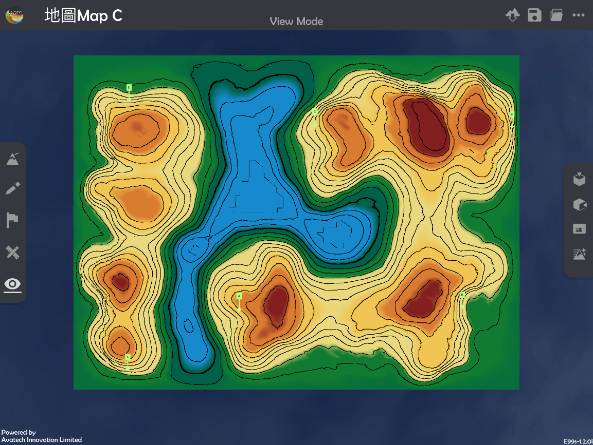
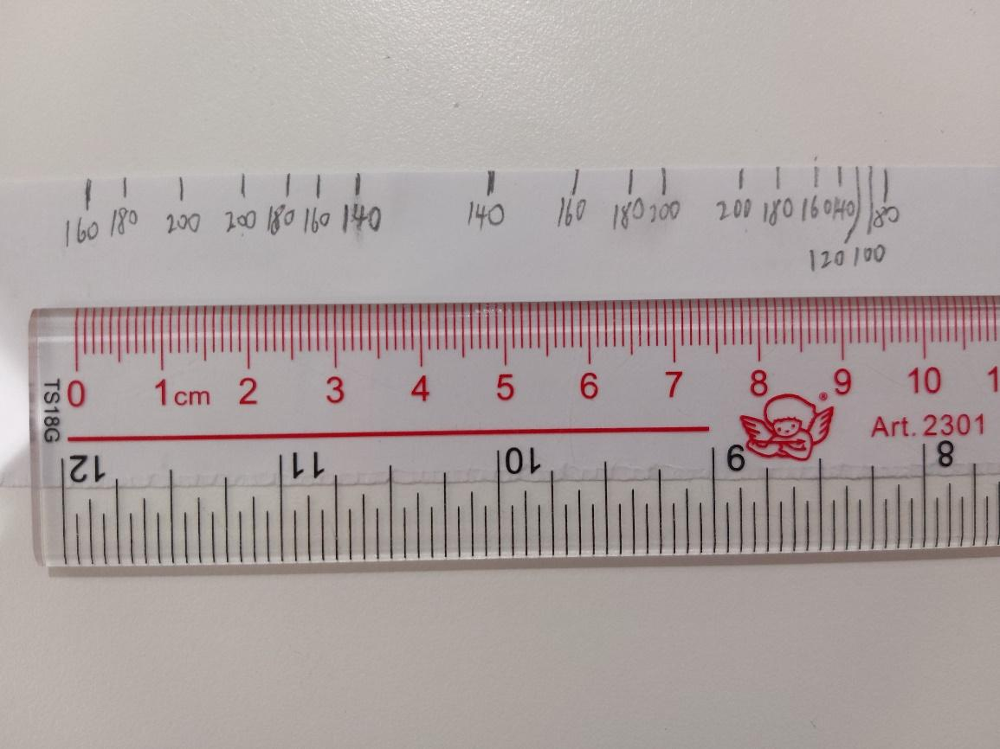
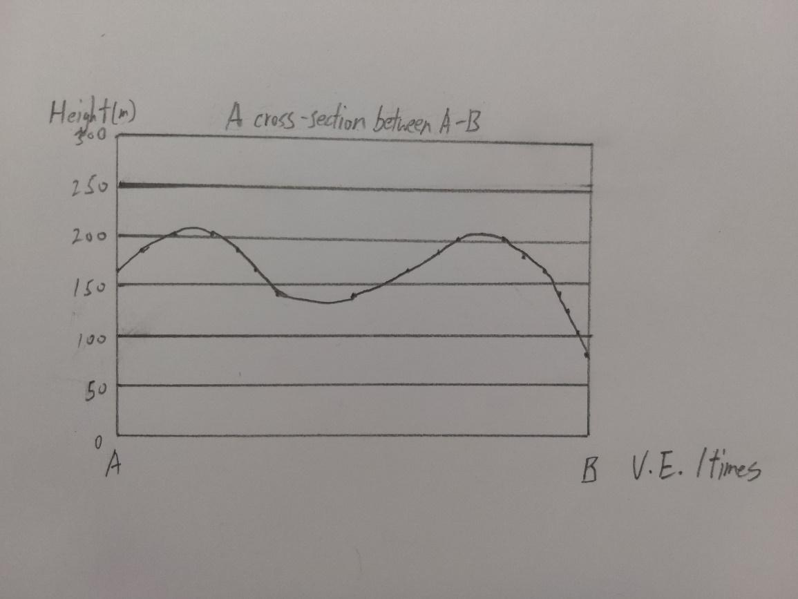
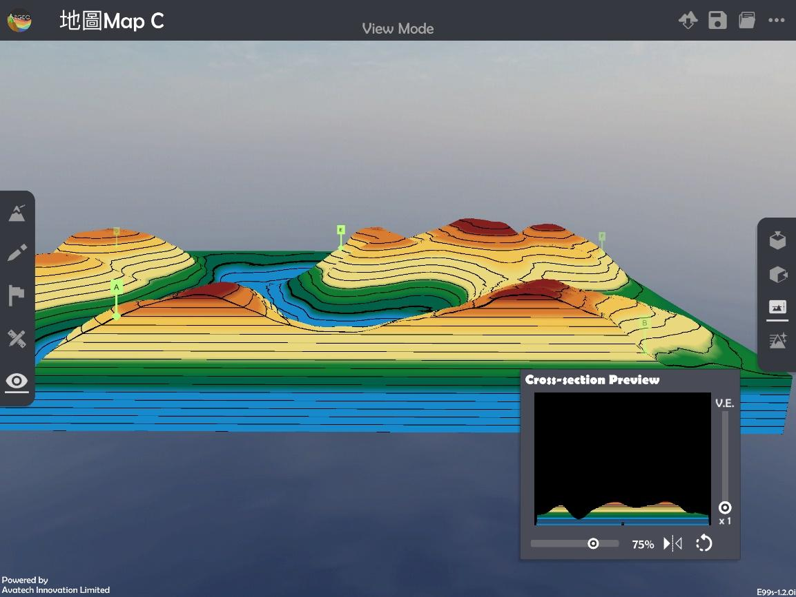

Cross-section
===================================

.. |preset_terrain| image:: cross_section_images/preset_terrain.png
   :width: 30

.. |terrain_edit_mode| image:: cross_section_images/terrain_edit_mode.png
   :width: 30

.. |mapview| image:: cross_section_images/mapview.png
   :width: 30

.. |get_ruler| image:: cross_section_images/get_ruler.png
   :width: 30

.. |viewmode| image:: cross_section_images/viewmode.png
   :width: 30

.. |cross_section| image:: cross_section_images/cross_section.png
   :width: 30

Teaching Demonstration
*********

The following demonstration shows the teaching procedures of cross-section by using ARGEO Portable. 

a. Select a landform from “Preset Terrain |preset_terrain|” or use “Terrain Modifying |terrain_edit_mode|”function to create a landform. The following example is to draw a cross-section from point A to B in “地圖Map C Preset Terrain”.

b. Apply “Map View |mapview|”.

.. image:: cross_section_images/cross_section2.png
  :width: 600
  :alt: Login Screen

c. Apply “Get Ruler |get_ruler|”.

.. image:: cross_section_images/cross_section3.png
  :width: 600
  :alt: Login Screen

d. Place and adjust the ruler on Point A and B.

.. image:: cross_section_images/cross_section4.png
  :width: 600
  :alt: Login Screen

e. Record the height of contour lines across the Point A and B on a piece of paper and ruler in real life.

f. Draw the cross-section with the paper which records the height.

g. Apply “View Mode |viewmode|”.

h. Select “Cross-section |cross_section|” and use the slider to adjuct and position of cross-section and vertical exaggeration to check the cross-section.

下載教學資源
***************
Teaching Demonstration
`Download Here <https://drive.google.com/file/d/1NqomonxqYHCGY8Ax197AUrpfoD0nG9lD/view?usp=sharing>`_

工作紙及答案(中文版)
`Download Here <https://drive.google.com/drive/folders/1ILmQLdeMXUSZbcGZqvOPCQjOST6Sn0uh?usp=sharing>`_

工作紙及答案(英文版)
`Download Here <https://drive.google.com/drive/folders/1Z0cfZKpeVzPHsX-sQse7sn7cYLWWFG1_?usp=sharing>`_

