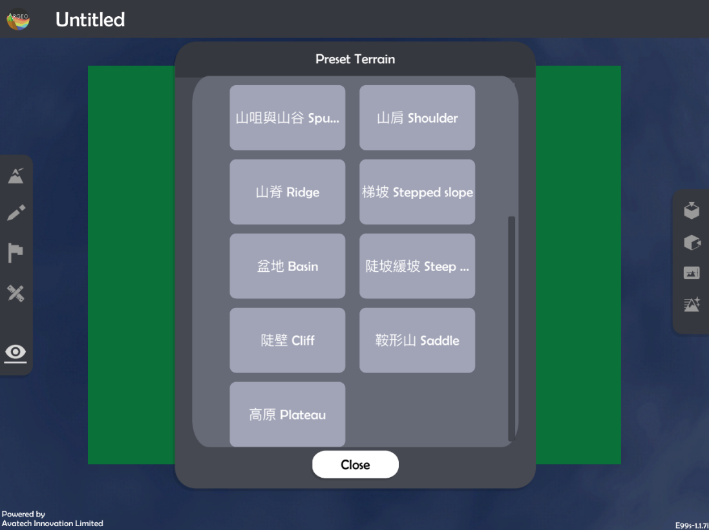
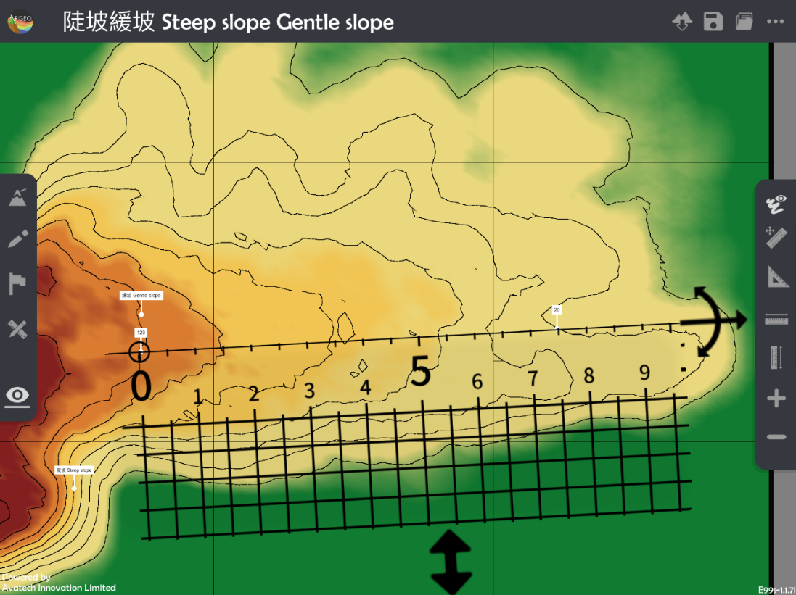

Gradient
===================================

.. |preset_terrain| image:: gradient_images/preset_terrain.png
   :width: 30

.. |terrain_edit_mode| image:: gradient_images/terrain_edit_mode.png
   :width: 30

.. |label| image:: gradient_images/label.png
   :width: 30

.. |mapview| image:: gradient_images/mapview.png
   :width: 30

Teaching Demonstration
*********

The following demonstration shows the teaching procedures of Gradient by using ARGEO Portable.

a. Select a slope from “Preset Terrain |preset_terrain|” or use “Terrain Modifying |terrain_edit_mode|” function to form a slope. The following example is “陡坡緩坡Steep slope Gentle slope”. 

b. Apply“Labelling Tools |label|”to mark two points on the slope and state the correct height.

.. image:: gradient_images/gradient2.png
  :width: 600
  :alt: Alternative text

Teacher can apply “Environment Option |environment_options|”to adjuct the vertical interva

.. |environment_options| image:: gradient_images/environment_options.png
   :width: 30

c. Calculate the vertical distance of two objects.

d. Apply “Map View |mapview|".

.. image:: gradient_images/gradient3.png
  :width: 600
  :alt: Alternative text 

e. Apply “Get Ruler |get_ruler|” to show the ruler on the screen.

.. image:: gradient_images/gradient4.png
  :width: 600
  :alt: Alternative text

f. Place and adjust the ruler on the objects to measure the straight-line horizontal distance. 
 

g. Calculate the gradient.

下載教學資源
***************
Teaching Demonstration
`Download Here <https://drive.google.com/file/d/19kp5-xxI0uoDpC6wKb2ozvDhCzYjOY9c/view?usp=sharing>`_

工作紙及答案(中文版)
`Download Here <https://drive.google.com/drive/folders/1-XFwKDM6wJ3b9bkNE6hLAVLOA4tpytVP?usp=sharing>`_

工作紙及答案(英文版)
`Download Here <https://drive.google.com/drive/folders/1NFPbJSBwv4nIPcX3-oBLdfH2WeGiNXPm?usp=sharing>`_