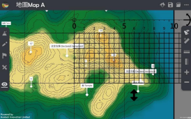

Grid Reference 
===================================

.. |preset_terrain| image:: grid_reference_images/preset_terrain.png
   :width: 30

.. |mapview| image:: grid_reference_images/mapview.png
   :width: 30

.. |horizontal_ruler| image:: grid_reference_images/horizontal_ruler.png
   :width: 30

.. |vertical_ruler| image:: grid_reference_images/vertical_ruler.png
   :width: 30

Teaching Demonstration
*********

The following demonstration shows the teaching procedures of Grid Reference by using ARGEO Portable. 

a. Select “Map A” in “Preset Terrain |preset_terrain| ”. 

b. Apply the “Map view |mapview|”. The grid lines are shown on the map. 

.. image:: grid_reference_images/grid_reference1.png
  :width: 600
  :alt: Alternative text

c. Press the grid line value. Set the starting point of northings is 10 and that of eastings is 65. (Teacher can  customise the grid line values.)  

d. Find the six-figure grid reference of point B.

Method 1

e. Place the ruler on the grid square. Count the grids from left to right, then from bottom to top (The first grid is 0 and  the last grid is 9). Take the readings to form six-figure grid reference. 

Method 2 

f. Press the “Horizontal ruler |horizontal_ruler|” button. Place the ruler on the point B and make it parallel to the northings. 

.. image:: grid_reference_images/grid_reference3.png
  :width: 600
  :alt: Alternative text

g. Each grid equals to 0.5 cm. The first grid is 0 and the last grid is 9. Take the reading of easting.

h. Press the “Vertical ruler |vertical_ruler|” button. Place the ruler on the point B and make it parallel to the eastings.

.. image:: grid_reference_images/grid_reference4.png
  :width: 600
  :alt: Alternative text

i. Each grid equals to 0.5 cm. The first grid is 0 and the last grid is 9. Take the reading of northing. 

.. image:: grid_reference_images/grid reference4.png
  :width: 600
  :alt: Alternative text

j. Combine the easting and northing readings to form a six-figure grid reference

下載教學資源
***************
Teaching Demonstration
`Download Here <https://drive.google.com/file/d/1ybrH-kOdVbjibZeJE5mFdPVlFdQPBJjL/view?usp=sharing>`_

工作紙及答案(中文版)
`Download Here <https://drive.google.com/drive/folders/17X3eHlA2yE2jvBB5eFTd2iQ05chh_UkP?usp=sharing>`_

工作紙及答案(英文版)
`Download Here <https://drive.google.com/drive/folders/1Hjg0CU7RWYMLQbXq5YUbtK3CF-OMaihT?usp=sharing>`_