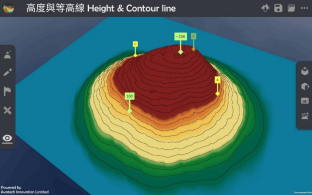

Height & Contour line  
===================================

.. |preset_terrain| image:: height_contour_line_images/preset_terrain.png
   :width: 30

.. |environment_options| image:: height_contour_line_images/environment_options.png
   :width: 30

Teaching Demonstration
*********

The following demonstration shows the teaching procedures of Height & Contour line by using ARGEO Portable. 

a. Apply the “Preset terrain |preset_terrain|” function. Select “Height & Contour line”. 

b. Adjust the “Vertical Interval” to 40 on the “Environment Options |environment_options|”. 

.. image:: height_contour_line_images/height_contour_line1.png
  :width: 600
  :alt: Login Screen

c. Refer to the information provided on the map. Find the height of point A, B and C.  

d. Teachers can create more landforms for teaching. 

下載教學資源
***************
Teaching Demonstration
`Download Here <https://drive.google.com/file/d/1-oSkAR-pfz0bR5fphi0kq0SEHqdhJEc0/view?usp=sharing>`_

工作紙及答案(中文版)
`Download Here <https://drive.google.com/drive/folders/1evydDGNfzUdUHAvcW9IYECk5D_iOhi38?usp=sharing>`_

工作紙及答案(英文版)
`Download Here <https://drive.google.com/drive/folders/1vu-qVJFd6_6pDEEsrE4tI3_1OL4k5VS0?usp=sharing>`_