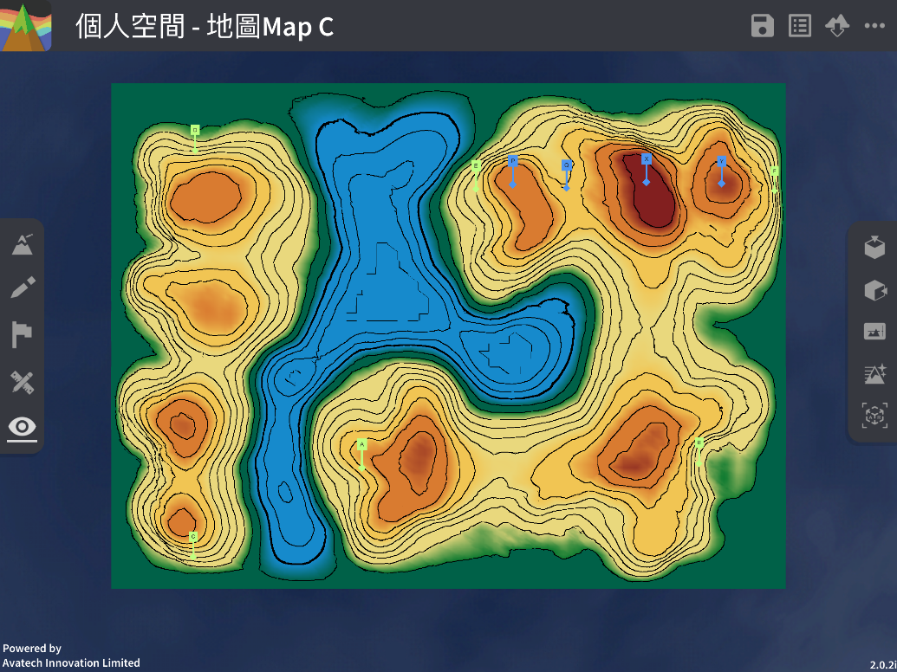

Intervisibility
===================================

.. |preset_terrain| image:: intervisibility_images/preset_terrain.png
   :width: 30

.. |terrain_edit_mode| image:: intervisibility_images/terrain_edit_mode.png
   :width: 30

Teaching Demonstration
*********

The following demonstration shows the teaching procedures of intervisibility by using ARGEO Portable.

a. Select a landform from “Preset Terrain”|preset_terrain| or use “Terrain Modifying”|terrain_edit_mode| function to create a landform. The following example is to determine the intervisibility of point E to F in “地圖Map C Preset Terrain”.

b. Draw the cross-section between point E to F. (Refer to cross-section guideline)

.. image:: intervisibility_images/intervisibility2.png
  :width: 600
  :alt: Login Screen

c. Determine the two points in the cross-section are visible or not.

.. image:: intervisibility_images/intervisibility3.png
  :width: 600
  :alt: Login Screen 

下載教學資源
***************
Teaching Demonstration
`Download Here <https://drive.google.com/file/d/1GWqbKvPYPepz4XyqQM9nFgW_1LeBDaGx/view?usp=sharing>`_

工作紙及答案(中文版)
`Download Here <https://drive.google.com/drive/folders/1MnBvbJ7F1HgXOfznDq_XWieaGtEh5fuL?usp=sharing>`_

工作紙及答案(英文版)
`Download Here <https://drive.google.com/drive/folders/1Dkf1vqwdYMsz1fRfiZRUftQ6ADoYWxiV?usp=sharing>`_