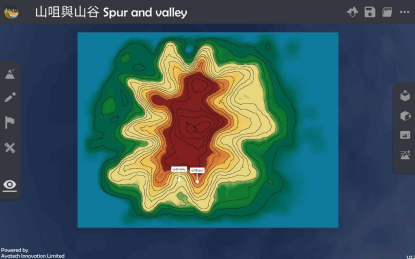
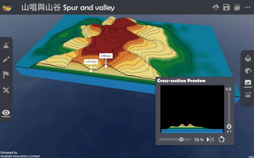

Relief
===================================

.. |preset_terrain| image:: relief_images/preset_terrain.png
   :width: 30

.. |topview| image:: relief_images/topview.png
   :width: 30

.. |viewmode| image:: relief_images/viewmode.png
   :width: 30

.. |cross_section| image:: relief_images/cross_section.png
   :width: 30

Teaching Demonstration
*********

The following demonstration shows the teaching procedures of Relief by using  ARGEO Portable.  

a. Select a relief which you want to teach in “Preset Terrain |preset_terrain|”. The following example is “山咀與山谷 Spur and valley”. 

.. image:: relief_images/relief1.png
  :width: 600
  :alt: Login Screen

b. Use“Top View |topview| ”function to observe the contour line of the relief.

c. Use“View Mode |viewmode|”to adjust the camera to observe the relief. 

.. image:: relief_images/relief3.png
  :width: 600
  :alt: Login Screen

d. Use “Cross-section |cross_section|”function and adjust the slider to the suitable position.

Adjuct the vertical exaggeration to observe the cross-section.

.. image:: relief_images/relief5.png
  :width: 600
  :alt: Login Screen 

下載教學資源
***************
Teaching Demonstration
`Download Here <https://drive.google.com/file/d/1Tj_ijsdVTe9D6oBr8S_JW2Sdn6DNBf18/view?usp=sharing>`_

工作紙及答案(中文版)
`Download Here <https://drive.google.com/drive/folders/1HkUXNRGgrk73h6h1_Oj8GT5MC5jjGNWT?usp=sharing>`_

工作紙及答案(英文版)
`Download Here <https://drive.google.com/drive/folders/19Q_KMspOaGp83fJk713zMUCbfws-vhCs?usp=sharing>`_
