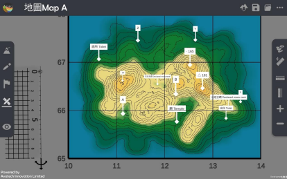
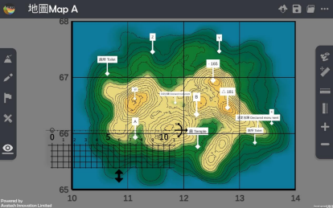

Straight-line distance 
===================================

.. |preset_terrain| image:: straight_line_distance_images/preset_terrain.png
   :width: 30

.. |terrain_edit_mode| image:: straight_line_distance_images/terrain_edit_mode.png
   :width: 30

.. |label| image:: straight_line_distance_images/label.png
   :width: 30

.. |mapview| image:: straight_line_distance_images/mapview.png
   :width: 30

Teaching Demonstration
*********

The following demonstration shows the teaching procedures of Straight-line distance  by using ARGEO Portable. 

a. Select a “Preset Terrain |preset_terrain|” or use “Terrain Modifying |terrain_edit_mode|” function to form a  terrain. The following example is “地圖 Map A”. 

.. image:: straight_line_distance_images/straight_line_distance1.png
  :width: 600
  :alt: Login Screen

b. Apply “Labelling Tools |label|” to mark two points on the terrain.

.. image:: straight_line_distance_images/straight_line_distance2.png
  :width: 600
  :alt: Login Screen

c. Apply “Map View |mapview|”. 

d. Apply “Get Ruler” to show the ruler on the screen.

e. Place and adjust the ruler on the two points. The following example is to measure the distance between toilet (106670) and spot height 165 (125669). 

.. image:: straight_line_distance_images/straight_line_distance5.png
  :width: 600
  :alt: Login Screen

Calculate the straight-line distance.

下載教學資源
***************
Teaching Demonstration
`Download Here <https://drive.google.com/file/d/1X8VxnZuft8cLTGL66m_V6eu9OWkhAicI/view?usp=sharing>`_

工作紙及答案(中文版)
`Download Here <https://drive.google.com/drive/folders/1QLrHqutPkC75cZDduW7OddyihZDEGRwD?usp=sharing>`_

工作紙及答案(英文版)
`Download Here <https://drive.google.com/drive/folders/1BmOVN-a5ZIyu6qyDqe3RaOYsik9lxPNq?usp=sharing>`_

