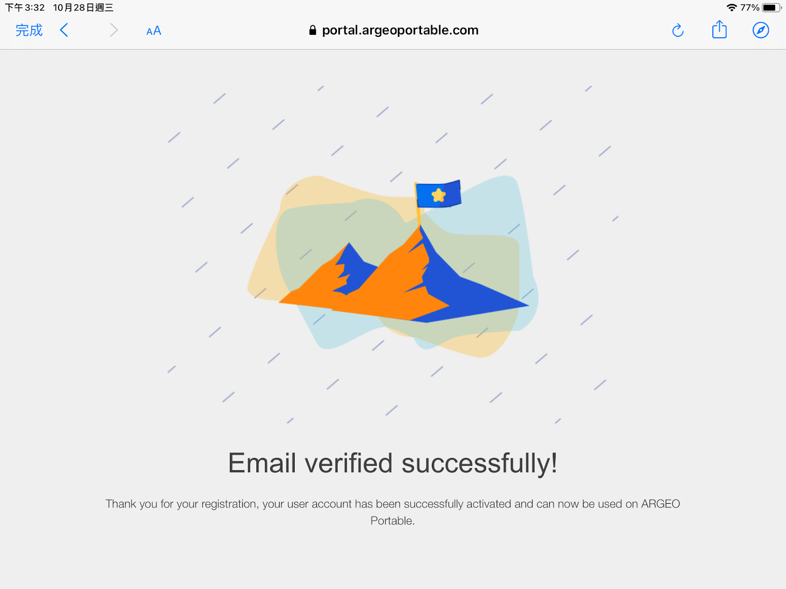
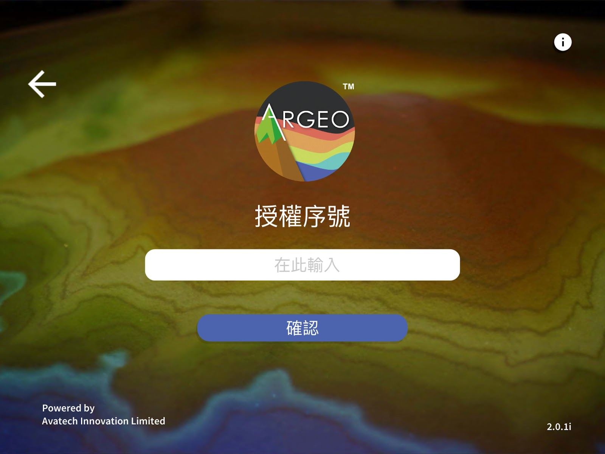

Account
===================================

Register Account
-----------------------
Click on \[Register Account\
] link

.. image:: account_images/accountreg.jpg
  :width: 600
  :alt: Login screen

Register account: Enter username (can be changed in the future), email address, password and confirmation password. 
	- Username can be in Chinese or English.
	- Please enter a real email address, which will be used for verification purpose later. 
	- Password can be in English, numbers or symbols, with a minimum length of 6 characters. 
	- Confirm Password: Enter your password once more time.

.. image:: account_images/accountreg1.jpg
  :width: 600
  :alt: Input Data

.. image:: account_images/accountreg2.jpg
  :width: 600
  :alt: Input Data

After successful registration, please check your email for email verification and click [Confirm Your Account Now] in the email.

.. image:: account_images/accountreg3.png
  :width: 600
  :alt: Alternative text

  

Then return to the ARGEO Portable app and click [I have been verified].

.. image:: account_images/accountreg5.jpg
  :width: 600
  :alt: Alternative text

Activate Teacher Account
-----------------------
Once the email verification is complete, please select the account type as Teacher, then click ‘Next’ and enter the license serial number.
	－license serial numbers are issued by the official system, if you do not have a license serial number, please contact us.

After confirmation, the following screen is loaded to indicate that the license has been successfully activated

.. image:: account_images/accountreg8.png
  :width: 600
  :alt: Alternative text

Activate Student Account
-----------------------
When email verification is complete, select the account type as Student, then click ‘Next’ and enter the Class Invitation Code.
- The Class Invitation Code is generated automatically when a class is created in the teacher's account.

After confirmation, the following screen will be loaded to indicate that you have successfully entered the class.

View Account Information
-----------------------
Click the [...] button at the top right, and then click the Personal Name column to view account information, including school name, number of users, license serial number, license expiry date, etc. You can share the license serial number with another teacher to activate the teacher's account. After activation with the same license serial number, the system will automatically add the teacher's account to your license and the number of users will be increased automatically.

.. image:: account_images/accountinfo.png
  :width: 600
  :alt: Alternative text

.. image:: account_images/accountinfo1.png
  :width: 600
  :alt: Alternative text

**Calculation of license Usage**
**Number of Users**
The number of users depends on the license scheme, which are the number of teacher users and the number of student users.
The number of teacher users is calculated based on the successful activation of the license by the teacher account, and is not counted if the teacher account leaves the license.
The number of student users is calculated based on the number of classes a student account successfully joins, even if a student account joins more than one class it will only take up one student user number, if the student account leaves the license, it will not be counted.

**More information**：My Classes - Teacher Accounts - Leave license；My Classes - Teacher Accounts - Remove Student license Permissions
Space Usage
Space usage is based on the license plan, and is the amount of space used by the teacher and the amount of space used by the student. If the occupied space usage is full, no new space can be created in the account.

Teacher space usage is based on the total number of spaces in ‘My Space’, ‘Blackboard’ and ‘Assignments’. Space usage is calculated based on space already created in the account and is not shared with other teacher accounts.

Student space usage is calculated for My Space and Assignments.

- My Space: Space usage is calculated on the space created in the account.

- Blackboard: Space usage is not calculated.

- Assignments: Space usage is calculated based on the number of assignments in the account. Since the assignments are created in the class from the teacher's account, if the teacher creates an assignment, the space usage for each student in the class will be increased by one. If a student's space usage is full, a new assignment created by the teacher can still be assigned to the student whose space usage is full, and the student will still be able to save the assignment. However, students can no longer create space in My Space, and the student's space usage will be shown as exceeded.

