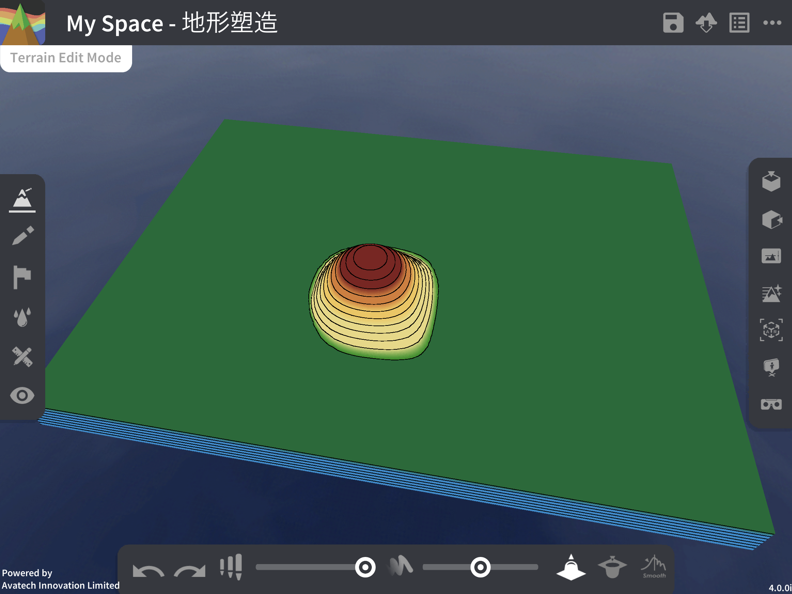
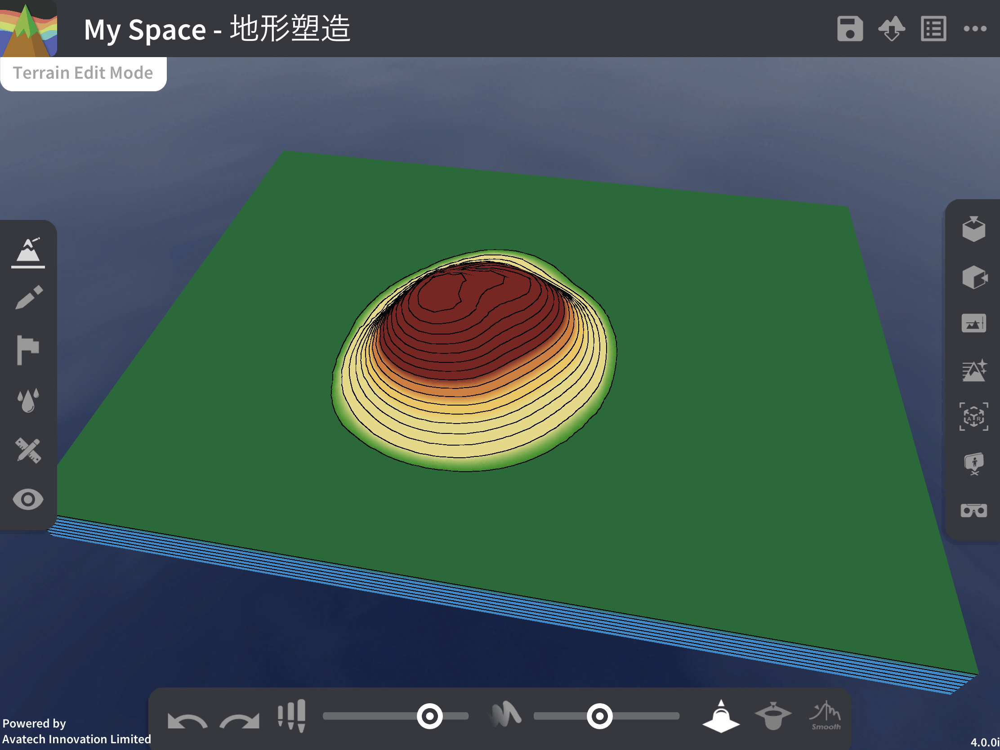
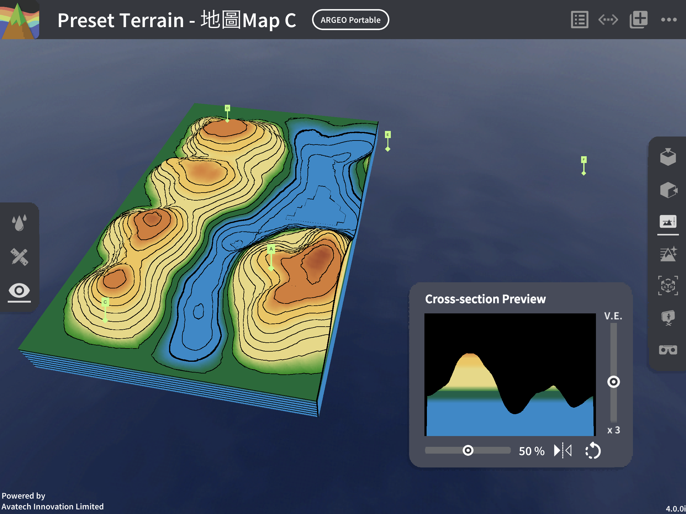
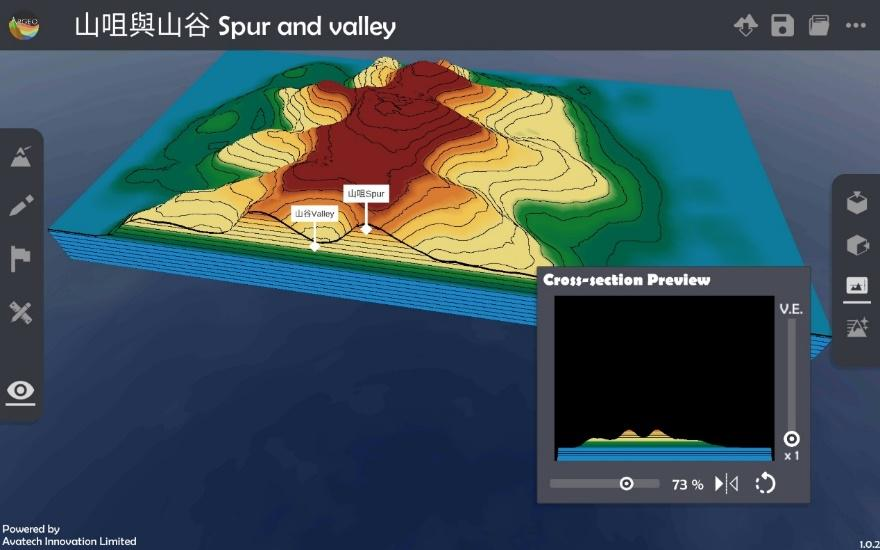
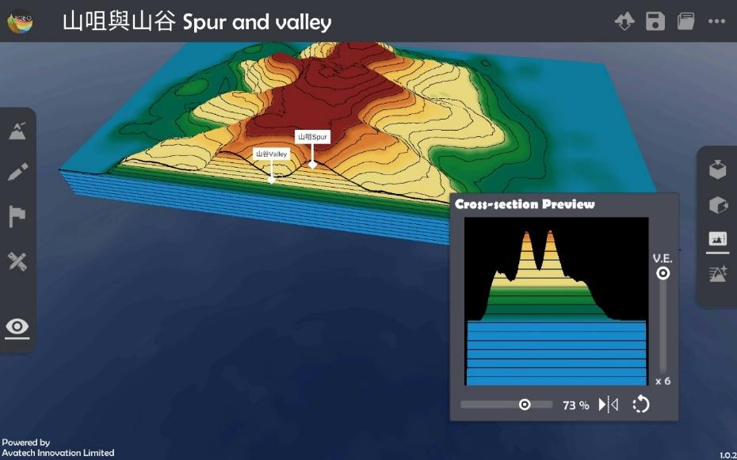
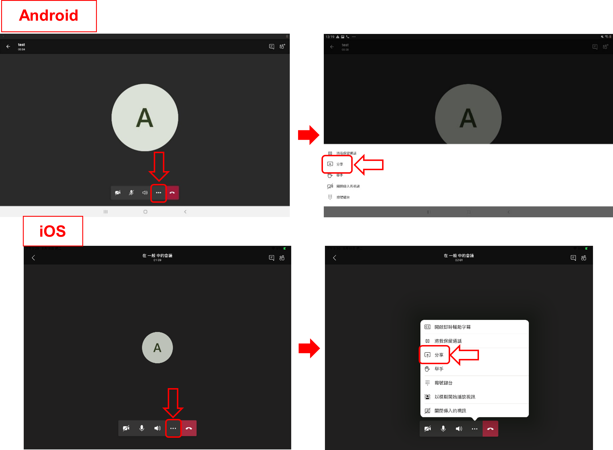
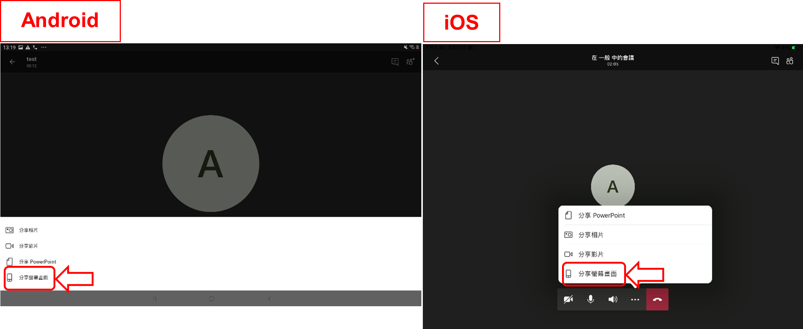

Operation instruction
=================================== 

.. |viewmode| image:: control_images/viewmode.png
   :width: 30

.. |topview| image:: control_images/topview.png
   :width: 30

.. |terrain_edit_mode| image:: control_images/terrain_edit_mode.png
   :width: 30

.. |brush_size| image:: control_images/brush_size.png
   :width: 30 

.. |extrude_up| image:: control_images/extrude_up.png 
   :width: 30

.. |pen| image:: control_images/pen.png
   :width: 30

.. |eraser| image:: control_images/eraser.png
   :width: 30

.. |undo_white| image:: control_images/undo_white.png
   :width: 30

.. |redo_white| image:: control_images/redo_white.png
   :width: 30

.. |clear| image:: control_images/clear.png
   :width: 30

.. |label| image:: control_images/label.png
   :width: 30

.. |mapview| image:: control_images/mapview.png
   :width: 30 

.. |ruler_rotate| image:: control_images/ruler_rotate.png
   :width: 30

.. |get_ruler| image:: control_images/get_ruler.png
   :width: 30 

.. |horizontal_ruler| image:: control_images/horizontal_ruler.png
   :width: 30

.. |vertical_ruler| image:: control_images/vertical_ruler.png
   :width: 30

.. |angle_ruler| image:: control_images/angle_ruler.png
   :width: 30

.. |cross_section| image:: control_images/cross_section.png
   :width: 30

.. |environmentoptions| image:: control_images/environmentoptions.png
   :width: 30

.. |presetterrain| image:: control_images/presetterrain.png
   :width: 30

Interface Introduction
-----------------------

.. image:: control_images/UI.png
  :width: 400
  :alt: Alternative text

Features Overview
-----------------------

.. image:: control_images/overall_function.png 
  :width: 400
  :alt: Alternative text

Features
-----------------------
View Control
    View Mode:
    Press |viewmode| on the left toolbar to activate the view mode, the lower tool console will be closed, users can adjust the viewing angle with one finger to move to the best viewing angle to observe the terrain from different angles.

Two-finger Gesture:
-----------------------
Users can adjust or rotate the viewing position, zoom in, zoom out and adjust the elevation angle with two fingers at any time.

.. image:: control_images/finger_control1.png
  :width: 400
  :alt: Alternative text

.. image:: control_images/finger_control2.png
  :width: 400
  :alt: Alternative text

.. image:: control_images/finger_control3.png
  :width: 400
  :alt: Alternative text

.. image:: control_images/finger_control6.png
  :width: 400
  :alt: Alternative text

Top View:
-----------------------
Click |topview| on the right toolbar to adjust the camera to the top view angle, and you can see the whole terrain from the top.

.. image:: control_images/overlook.png
  :width: 400
  :alt: Alternative text

Default View:
-----------------------
Click on |sideview| in the right toolbar to return to the default view as when entering the terrain, viewing the terrain from the other side.

.. image:: control_images/default_angle.jpg
  :width: 400
  :alt: Alternative text

Terrain Modifying
-----------------------
Press |terrain_edit_mode| on the left toolbar to activate terrain modifying, the tool console will pop up at the bottom, users can raise or lower the terrain in the contact position with one finger to shape the terrain with different shapes.

.. image:: control_images/terrain_modifying.png
  :width: 400
  :alt: Alternative text

Terrain shaping tool console:

Adjust the size of the shaping area |brush_size| : Adjusts the size of the shaping area, the further to the right the slider, the larger the shaping area.

.. image:: control_images/modifying_size2.png
  :width: 400
  :alt: Alternative text

Brush_strength |brush_strength| : Adjust the brushing strength, the brushing strength is the speed of the terrain raising or lowering, the more the slider is to the right, the more the brushing strength will be.

.. image:: control_images/modifying_strength1.png
  :width: 400
  :alt: Alternative text

.. image:: control_images/modifying_strength2.png
  :width: 400
  :alt: Alternative text

raise/reduce |extrude_up| |reduce| : Select raise or reduce to determine whether to raise or lower the terrain when shaping.

.. image:: control_images/modifying_height2.png
  :width: 400
  :alt: Alternative text

Drawing Tools
-----------------------
Press |pen| on the left toolbar to activate the Drawing Tools, the tool console will pop up at the bottom, users can draw and write on the terrain, and a single finger stroke over the terrain will leave a handwriting mark, which will help users to explain the lesson content.

.. image:: control_images/drawing_tools.png
  :width: 400
  :alt: Alternative text

Drawing tools tool console:

Colour: Choose the colour of the brush, there are five colours: red, blue, yellow, green and white.

Eraser |eraser| : With the eraser, the stroke made with one finger will be erased. To exit the eraser state, click this again to return to the brush state
Previous |undo_white| : Undo the previous action, including drawing and eraser clearing (Note: not include the Clear All action)
Next |redo_white| : Redo the next action, including drawing and eraser clearing (Note: not include the Clear All action)
Clear All |clear| : Clears all strokes and brushstrokes from the terrain, this action cannot be undone.

Labelling Tools
-----------------------
Press |label| on the left toolbar to activate the Labelling Tools, the tool console will pop up at the bottom of the tool, users can place markers on the terrain to mark and describe the terrain features, and touch the terrain with one finger to add markers. When adding a new label, the keyboard will pop up for users to input the label content, the selected label content will be displayed in the tool console, click other labels to select them for editing.

.. image:: control_images/labelling_tools1.png
  :width: 400
  :alt: Alternative text

.. image:: control_images/labelling_tools2.png
  :width: 400
  :alt: Alternative text

Marker tool console:

Colour: Choose the colour of the marker, there are five colours: red, blue, yellow, green and white
New Marker: Add a new marker and edit it
Clear Marker: Clear the selected marker.

Map View
-----------------------
Press |mapview| on the left toolbar to activate the map interface, the lower tool console will be closed, and then the terrain will be turned into a grid map, the right toolbar will be turned into a measurement toolbar, where you can activate different measurement tools, use a ruler and protractor to measure and calculate, in order to teach map reading grid coordinates and scale calculations.

.. image:: control_images/mapviewlayout.png
  :width: 400
  :alt: Alternative text

Map Interface Tools:

Grid square: the map will be added a 4 by 3 grid, click on any number on the eastbound (easting) or northbound (northing) line, the keyboard will pop up for the user to change the value corresponding to the coordinates on the bottom left
Hide the handwriting |drawing_hide| : click to hide all the handwriting on the terrain, and then click again to redisplay the handwriting

Ruler:
  - Move ruler: Click and pull the ruler to move it to the position where your finger touches it.
  - Adjust length |ruler_rotate| : Tap and pull back and forth (missing photo) to adjust the length of the ruler.
  - Adjust the direction |ruler_rotate| : Click and pull up and down (missing photo) to adjust the direction of the ruler.
  - Adjust width : Click and pull to adjust the width of the ruler, increase the width to use it as a grid ruler.
  - Call ruler |get_ruler| : Move the ruler to the left side of the screen, its length and width will be changed to a lower value. If the ruler is moved to an invisible position, you can click here to call the ruler to an easily accessible position.
  - Horizontal |horizontal_ruler| : Adjust the ruler to horizontal direction.
  - Vertical |vertical_ruler|: Adjust the ruler to vertical direction.

Protractor:
  - Move protractor: Click and pull the protractor to move it to the position where your finger touches it.
  - Rotate protractor |ruler_rotate| : Click and pull the missing photo next to the protractor clockwise or anti-clockwise to rotate it in the corresponding direction.
  - Call protractor |angle_ruler|: Move the protractor to the right side of the screen, if the ruler is moved out of view, you can click here to call the protractor to a convenient location.

Zoom In: Zoom in on the map

Zoom Out: Zoom out the map.

Cross-section
-----------------------
Click |cross_section| in the right toolbar to display the cross-section terrain.

.. image:: control_images/cross_section_layout.png
  :width: 400
  :alt: Alternative text

橫切面介面:

垂直誇大率(V.E.): 調整橫切面圖的垂直誇大率，滑桿標越上誇大率越大

切割方向: 改變橫切面的切割方向，可選擇橫向或縱向

.. image:: control_images/cross_section_direction.png
  :width: 400
  :alt: Alternative text

觀察角度 |flip| : 改變觀察橫切面的視角，可選擇由正面或背面觀察

.. image:: control_images/cross_section_view.png
  :width: 400
  :alt: Alternative text

橫切面位置: 調整橫切面的切割位置

Environment Options
-----------------------
Click on the right toolbar |environmentoptions| to change the environmental features of the terrain.

.. image:: control_images/environment_adjust.png
  :width: 400
  :alt: Alternative text

Adjustable environmental options:
Terrain color: Choose between natural terrain or black-and-white terrain.

.. image:: control_images/environment_adjust_color.png
  :width: 400
  :alt: Alternative text

Horizon line: Adjust the sea level height, with a minimum value of -5 and a maximum value of 5. This is used to simulate the topography of continents or islands, adjusting the area of sea and land. The further the slider is to the right, the higher the sea level.

.. image:: control_images/horizontal_line1.png
  :width: 400
  :alt: Alternative text

.. image:: control_images/horizontal_line2.png
  :width: 400
  :alt: Alternative text

Vertical spacing: Adjust the vertical spacing, with a minimum value of 10 and a maximum value of 80. The further the slider is to the right, the greater the vertical spacing.

.. image:: control_images/Vertical_Interval1.png
  :width: 400
  :alt: Alternative text

Terrain texture: Choose the geographic mode for easier understanding of classroom content, or use the realistic mode to view the terrain for a more authentic experience.

.. image:: control_images/texture1.png
  :width: 400
  :alt: Alternative text 

.. image:: control_images/texture2.png
  :width: 400
  :alt: Alternative text 

.. image:: control_images/texture3.png
  :width: 400
  :alt: Alternative text 

Teaching Demonstration
-----------------------
Topic 1: Height & Contour Line

The following demonstration shows how to teach the unit on height and contour lines using ARGEO Portable.

a. In the "Preset Terrain |presetterrain|" select "Height & Contour Line."
b. In the "Environment Options |environmentoptions|" adjust the "Vertical Interval" to 40.

.. image:: control_images/heightcontourline1.jpg
  :width: 400
  :alt: Alternative text

c. Using the preset elevation points and other contour line indicators, determine the heights of points A, B, and C.

.. image:: control_images/heightcontourline2.jpg
  :width: 400
  :alt: Alternative text

d. The teacher can create more terrain to instruct students.

Topic 2: Relief
The following demonstrates how to teach the terrain unit by using ARGEO Portable.
Select a 'Preset Terrain' and choose the terrain you wish to teach.

a. Select a 'Preset Terrain |presetterrain| ' and choose the terrain you wish to teach.

.. image:: control_images/relief1.png
  :width: 400
  :alt: Alternative text

b. Use the 'Top view |topview|' feature to observe the contour lines of the terrain.

.. image:: control_images/relief2.jpg
  :width: 400
  :alt: Alternative text

c. Select 'View mode |viewmode|' to adjust the perspective for observing the terrain.

.. image:: control_images/relief3.jpg
  :width: 400
  :alt: Alternative text

d. Select the 'Cross Section |cross_section|' feature and adjust the cross section to the appropriate position using the slider.

e. Adjust the vertical exaggeration to observe the cross-sectional view.

遙距教學使用
-----------------------
Zoom
- Start sharing your screen:
1. Click 'Share' at the bottom (Android) or in the upper right corner (iOS), then select 'Screen' (Android) / 'Screen' (iOS) (Note: Users must be the host or have permission from the host to share their screen).

2. Press 'Start Now' (Android) or 'Start Live' (iOS) to confirm sharing.

3. Successfully shared the user's device screen (Note: Once sharing begins, all participants can see all information on the screen, including notifications and other app screens. If there is any information you do not wish to make public, please change your settings in advance or avoid opening content during the sharing period). (Android users note: After sharing begins, it will jump to the device's home screen).

.. image:: control_images/zoom3.png
  :width: 400
  :alt: Alternative text

4. Press the home button to leave Zoom without closing the application, then open the ARGEO Portable app to begin teaching.

- To stop screen sharing:
  After the lesson ends, exit ARGEO Portable.
  For Android: Return to Zoom and click 'Stop Live' at the bottom / 'Stop Share' in the lower toolbar.
  For iOS: Return to Zoom and click 'Stop Live' in the center of the screen / end the live broadcast in the control center.

.. image:: control_images/zoom4.png
  :width: 400
  :alt: Alternative text

Google Meet
- Start sharing your screen:
1. Tap the options in the upper right corner, then select 'Display Screen' (Android) or 'Share Screen' (iOS).

.. image:: control_images/googlemeet1.png
  :width: 400
  :alt: Alternative text

2. Press 'Start Display' and then tap 'Start Now' (Android) / 'Start Live' (iOS) to confirm sharing.

.. image:: control_images/googlemeet2.png
  :width: 400
  :alt: Alternative text

3. Successfully shared the user's device screen (Note: Once sharing begins, all participants can see all information on the screen, including notifications and other app screens. If there is any information you do not wish to make public, please change your settings in advance or avoid opening content during the sharing period).

4. Press the home button to leave Meet without closing the application, then open the ARGEO Portable app to begin teaching.

- To stop screen sharing:
  After the lesson ends, exit ARGEO Portable.
  For Android: Return to Meet and tap 'Stop Display' in the center of the screen.
  For iOS: Return to Meet and tap 'Stop Live' in the center of the screen / end the live broadcast in the control center.

.. image:: control_images/googlemeet4.png
  :width: 400
  :alt: Alternative text

Microsoft Teams

- Start sharing your screen:
1. Tap the option below and select 'Share'.

2. Select share screen.

3. Press 'Start Now' (Android) or 'Start Live' (iOS) to confirm sharing.

.. image:: control_images/microsoftteams3.png
  :width: 400
  :alt: Alternative text

4. Successfully shared the user's device screen (Note: Once sharing begins, all participants can see all information on the screen, including notifications and other app screens. If there is any information you do not wish to make public, please change your settings in advance or avoid opening content during the sharing period).

.. image:: control_images/microsoftteams4.png
  :width: 400
  :alt: Alternative text

5. Press the home button to leave Teams without closing the application, then open the ARGEO Portable app to begin teaching.

- To stop screen sharing:
  After the lesson ends, exit ARGEO Portable.
  For Android: Return to Teams and tap 'Stop Presentation' at the bottom.
  For iOS: Return to Teams and tap 'Stop Live' in the center of the screen / end the live broadcast in the control center.

.. image:: control_images/microsoftteams5.png
  :width: 400
  :alt: Alternative text

