Operation instruction
=================================== 

.. |viewmode| image:: control_images/viewmode.png
   :width: 30

.. |topview| image:: control_images/topview.png
   :width: 30

.. |sideview| image:: control_images/sideview.png
   :width: 30

.. |terrain_edit_mode| image:: control_images/terrain_edit_mode.png
   :width: 30

.. |brush_size| image:: control_images/brush_size.png
   :width: 30 

.. |brush_strength| image:: control_images/brush_strength.png
   :width: 30

.. |reduce| image:: control_images/reduce.png
   :width: 30

.. |pen| image:: control_images/pen.png
   :width: 30

.. |eraser| image:: control_images/eraser.png
   :width: 30

.. |undo_white| image:: control_images/undo_white.png
   :width: 30

.. |label| image:: control_images/label.png
   :width: 30

.. |mapview| image:: control_images/mapview.png
   :width: 30 

.. |drawing_hide| image:: control_images/drawing_hide.png
   :width: 30

.. |ruler_rotate| image:: control_images/ruler_rotate.png
   :width: 30

.. |get_ruler| image:: control_images/get_ruler.png
   :width: 30 

.. |horizontal_ruler| image:: control_images/horizontal_ruler.png
   :width: 30

.. |vertical_ruler| image:: control_images/vertical_ruler.png
   :width: 30

.. |angle_ruler| image:: control_images/angle_ruler.png
   :width: 30

.. |cross_section| image:: control_images/cross_section.png
   :width: 30

.. |flip| image:: control_images/flip.png
   :width: 30

.. |environmentoptions| image:: control_images/environmentoptions.png
   :width: 30

.. |presetterrain| image:: control_images/presetterrain.png
   :width: 30

Interface Introduction
-----------------------

.. image:: control_images/UI.png
  :width: 400
  :alt: Alternative text

Features Overview
-----------------------

Features
-----------------------
View Control
    觀View Mode:
    Press |viewmode| on the left toolbar to activate the view mode, the lower tool console will be closed, users can adjust the viewing angle with one finger to move to the best viewing angle to observe the terrain from different angles.

.. image:: control_images/view_control_mode.png
  :width: 400
  :alt: Alternative text

Two-finger Gesture:
-----------------------
Users can adjust or rotate the viewing position, zoom in, zoom out and adjust the elevation angle with two fingers at any time.

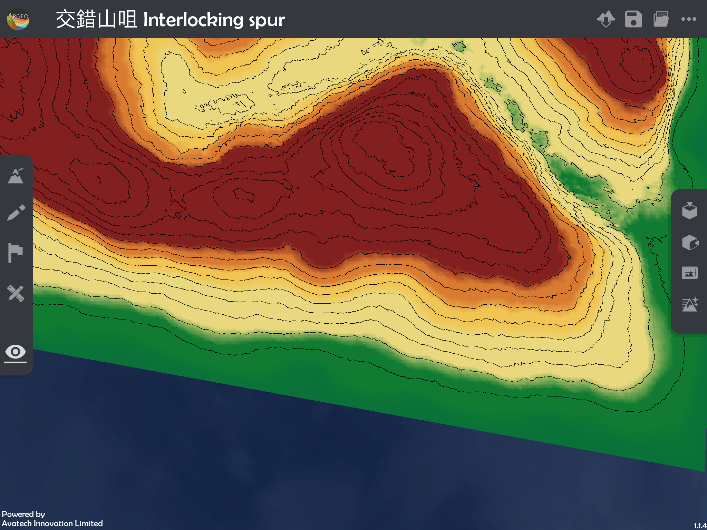

.. image:: control_images/finger_control2.png
  :width: 400
  :alt: Alternative text

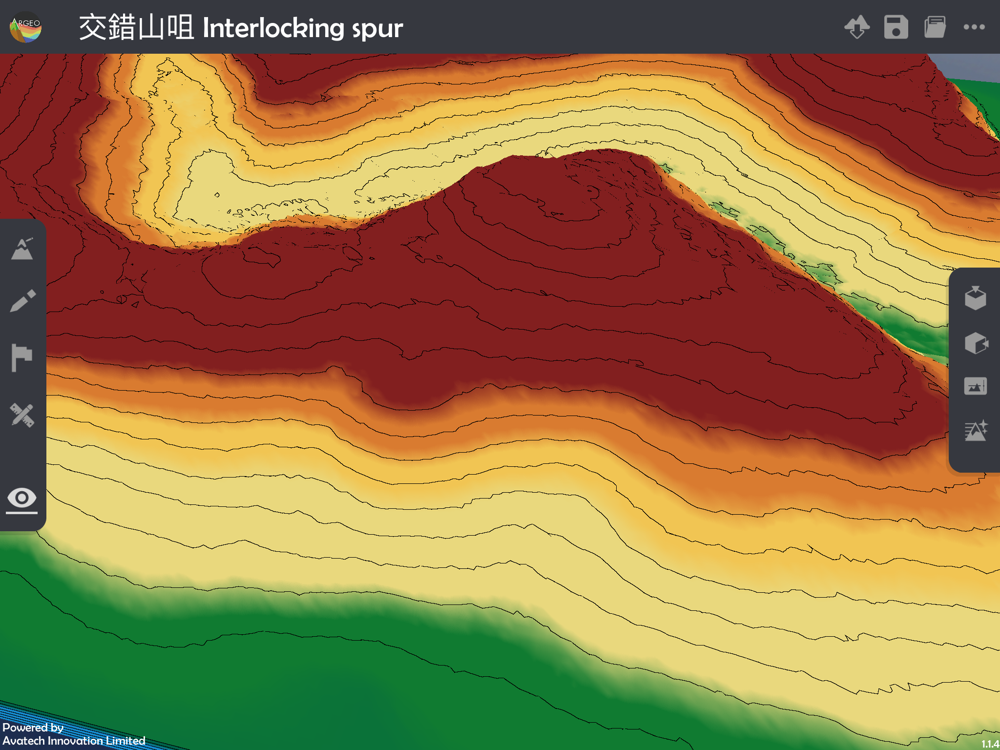

.. image:: control_images/finger_control4.png
  :width: 400
  :alt: Alternative text

.. image:: control_images/finger_control5.png
  :width: 400
  :alt: Alternative text

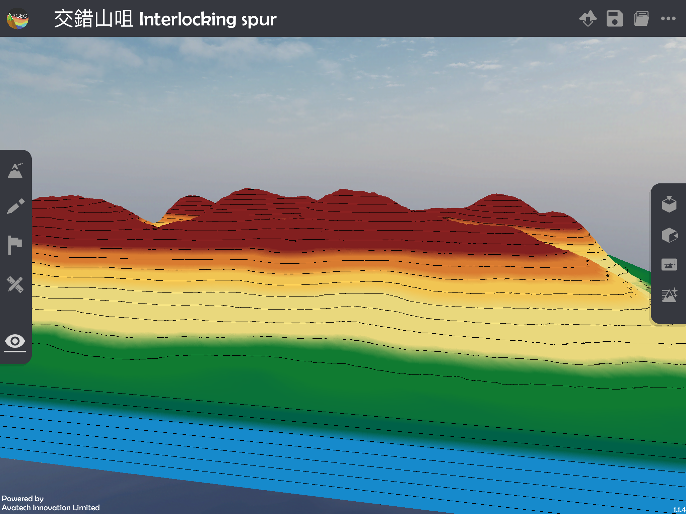

Top View:
-----------------------
Click |topview| on the right toolbar to adjust the camera to the top view angle, and you can see the whole terrain from the top.

.. image:: control_images/overlook.png
  :width: 400
  :alt: Alternative text

Default View:
-----------------------
Click on |sideview| in the right toolbar to return to the default view as when entering the terrain, viewing the terrain from the other side.

.. image:: control_images/default_angle.jpg
  :width: 400
  :alt: Alternative text

Terrain Modifying
-----------------------
Press |terrain_edit_mode| on the left toolbar to activate terrain modifying, the tool console will pop up at the bottom, users can raise or lower the terrain in the contact position with one finger to shape the terrain with different shapes.

.. image:: control_images/terrain_modifying.png
  :width: 400
  :alt: Alternative text

Terrain shaping tool console:

Adjust the size of the shaping area |brush_size| : Adjusts the size of the shaping area, the further to the right the slider, the larger the shaping area.

.. image:: control_images/modifying_size1.png
  :width: 400
  :alt: Alternative text

.. image:: control_images/modifying_size2.png
  :width: 400
  :alt: Alternative text

Brush_strength |brush_strength| : Adjust the brushing strength, the brushing strength is the speed of the terrain raising or lowering, the more the slider is to the right, the more the brushing strength will be.

.. image:: control_images/modifying_strength1.png
  :width: 400
  :alt: Alternative text

.. image:: control_images/modifying_strength2.png
  :width: 400
  :alt: Alternative text

raise/reduce |extrude_up| |reduce| : Select raise or reduce to determine whether to raise or lower the terrain when shaping.

.. image:: control_images/modifying_height1.png
  :width: 400
  :alt: Alternative text

.. image:: control_images/modifying_height2.png
  :width: 400
  :alt: Alternative text

Drawing Tools
-----------------------
Press |pen| on the left toolbar to activate the Drawing Tools, the tool console will pop up at the bottom, users can draw and write on the terrain, and a single finger stroke over the terrain will leave a handwriting mark, which will help users to explain the lesson content.

.. image:: control_images/drawing_tools.png
  :width: 400
  :alt: Alternative text

Drawing tools tool console:

Colour: Choose the colour of the brush, there are five colours: red, blue, yellow, green and white.

Eraser |eraser| : With the eraser, the stroke made with one finger will be erased. To exit the eraser state, click this again to return to the brush state
Previous |undo_white| : Undo the previous action, including drawing and eraser clearing (Note: not include the Clear All action)
Next |redo_white| : Redo the next action, including drawing and eraser clearing (Note: not include the Clear All action)
Clear All |clear| : Clears all strokes and brushstrokes from the terrain, this action cannot be undone.

Labelling Tools
-----------------------
Press |label| on the left toolbar to activate the Labelling Tools, the tool console will pop up at the bottom of the tool, users can place markers on the terrain to mark and describe the terrain features, and touch the terrain with one finger to add markers. When adding a new label, the keyboard will pop up for users to input the label content, the selected label content will be displayed in the tool console, click other labels to select them for editing.

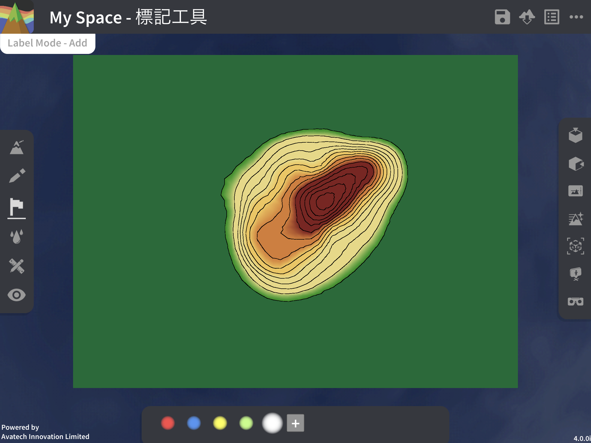

.. image:: control_images/labelling_tools2.png
  :width: 400
  :alt: Alternative text

Marker tool console:

Colour: Choose the colour of the marker, there are five colours: red, blue, yellow, green and white
New Marker: Add a new marker and edit it
Clear Marker: Clear the selected marker.

Map View
-----------------------
Press |mapview| on the left toolbar to activate the map interface, the lower tool console will be closed, and then the terrain will be turned into a grid map, the right toolbar will be turned into a measurement toolbar, where you can activate different measurement tools, use a ruler and protractor to measure and calculate, in order to teach map reading grid coordinates and scale calculations.

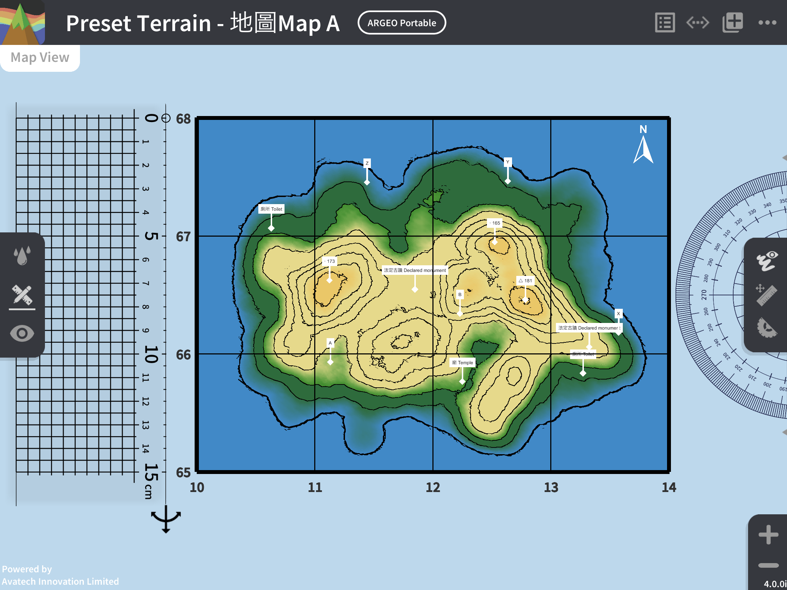

Map Interface Tools:

Grid square: the map will be added a 4 by 3 grid, click on any number on the eastbound (easting) or northbound (northing) line, the keyboard will pop up for the user to change the value corresponding to the coordinates on the bottom left
Hide the handwriting |drawing_hide| : click to hide all the handwriting on the terrain, and then click again to redisplay the handwriting

Ruler:
  - Move ruler: Click and pull the ruler to move it to the position where your finger touches it.
  - Adjust length |ruler_rotate| : Tap and pull back and forth (missing photo) to adjust the length of the ruler.
  - Adjust the direction |ruler_rotate| : Click and pull up and down (missing photo) to adjust the direction of the ruler.
  - Adjust width : Click and pull to adjust the width of the ruler, increase the width to use it as a grid ruler.
  - Call ruler |get_ruler| : Move the ruler to the left side of the screen, its length and width will be changed to a lower value. If the ruler is moved to an invisible position, you can click here to call the ruler to an easily accessible position.
  - Horizontal |horizontal_ruler| : Adjust the ruler to horizontal direction.
  - Vertical |vertical_ruler|: Adjust the ruler to vertical direction.

Protractor:
  - Move protractor: Click and pull the protractor to move it to the position where your finger touches it.
  - Rotate protractor |ruler_rotate| : Click and pull the missing photo next to the protractor clockwise or anti-clockwise to rotate it in the corresponding direction.
  - Call protractor |angle_ruler|: Move the protractor to the right side of the screen, if the ruler is moved out of view, you can click here to call the protractor to a convenient location.

Zoom In: Zoom in on the map

Zoom Out: Zoom out the map.

Cross-section
-----------------------
Click |cross_section| in the right toolbar to display the cross-section terrain.

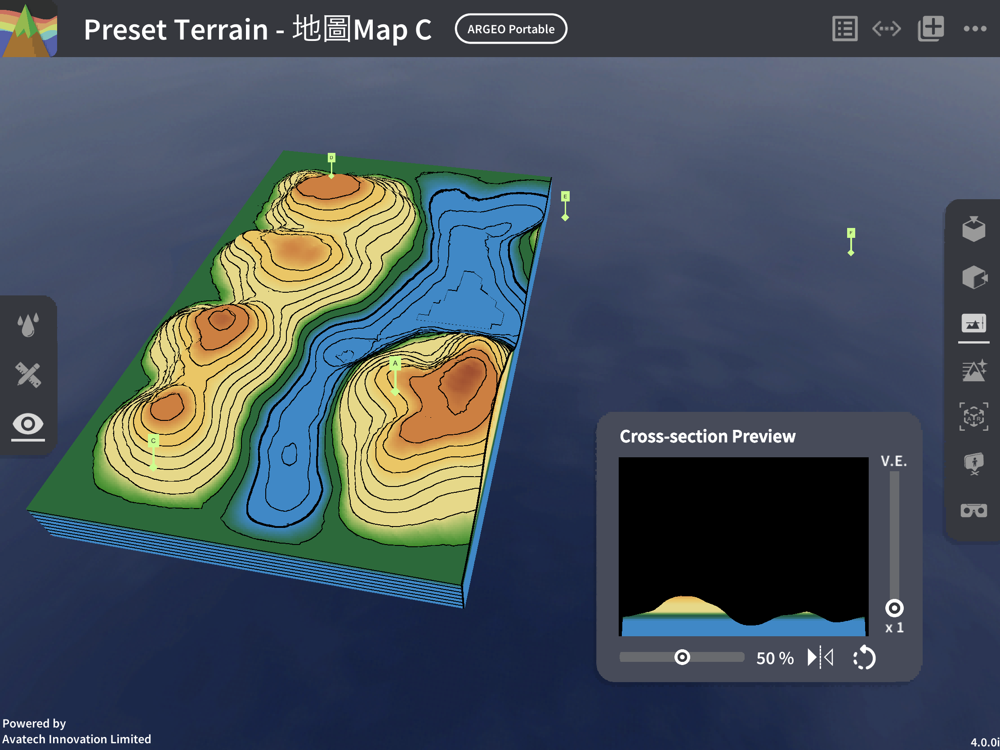

橫切面介面:

垂直誇大率(V.E.): 調整橫切面圖的垂直誇大率，滑桿標越上誇大率越大

.. image:: control_images/cross_section_ve.png
  :width: 400
  :alt: Alternative text

切割方向: 改變橫切面的切割方向，可選擇橫向或縱向

.. image:: control_images/cross_section_direction.png
  :width: 400
  :alt: Alternative text

觀察角度 |flip| : 改變觀察橫切面的視角，可選擇由正面或背面觀察

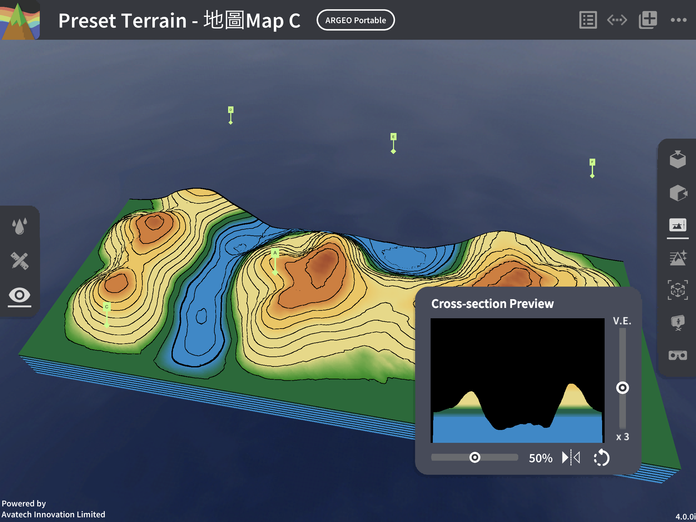

橫切面位置: 調整橫切面的切割位置

.. image:: control_images/cross_section_position.png
  :width: 400
  :alt: Alternative text

環境調整(Environment Options)
-----------------------
按右邊工具欄的 |environmentoptions| 以更改地形的環境特點

.. image:: control_images/environment_adjust.png
  :width: 400
  :alt: Alternative text

可調整的環境選項:
地貌顏色: 選擇自然地貌或黑白色的地形

.. image:: control_images/environment_adjust_color.png
  :width: 400
  :alt: Alternative text

水平線: 調校海平面高度，最小值為-5，最大值為5，用作模擬大陸或離島的地勢，調整海及陸地面積，滑桿標越靠右海平面越高

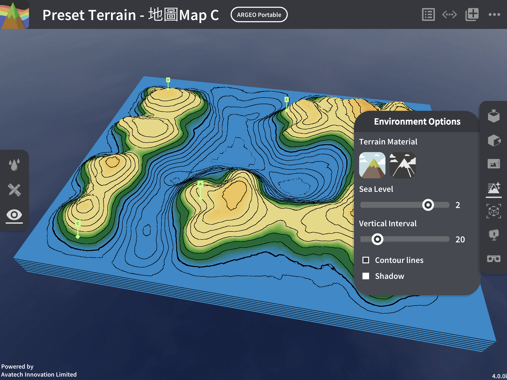

垂直間距: 調校垂直間距，最小值為10，最大值為80，滑桿標越靠右垂直間距越大

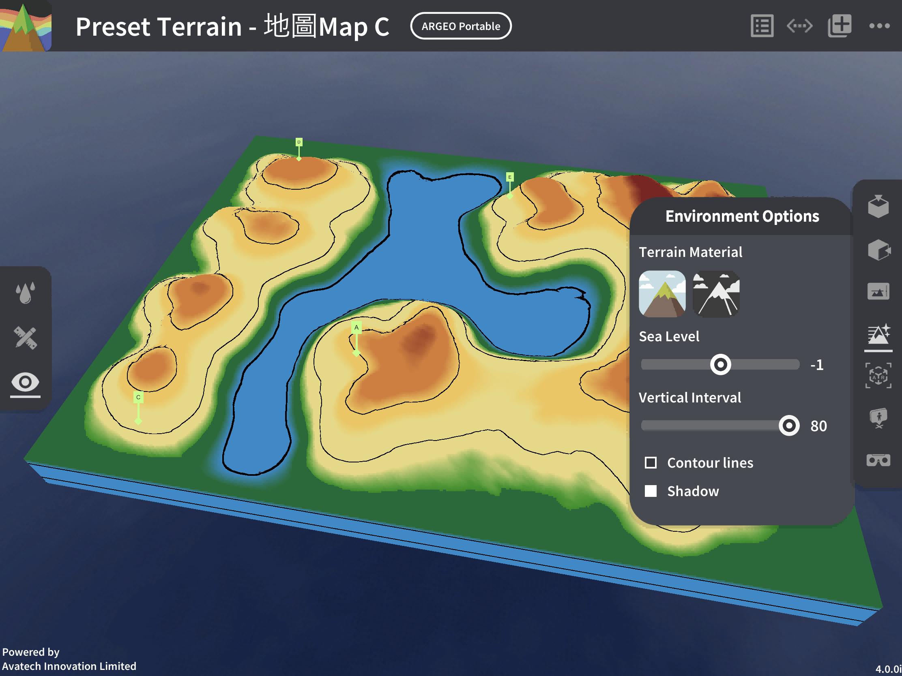

.. image:: control_images/Vertical_Interval2.png
  :width: 400
  :alt: Alternative text

地形質感: 選擇地理模式檢視方便理解課堂內容或以真實模式檢視地形以營造真實感

.. image:: control_images/texture1.png
  :width: 400
  :alt: Alternative text 

.. image:: control_images/texture2.png
  :width: 400
  :alt: Alternative text 

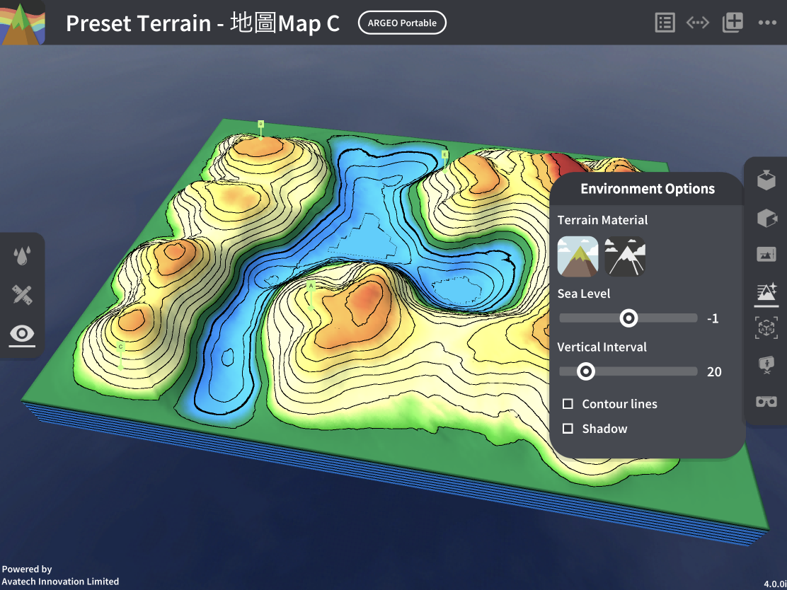

教學示範
-----------------------
課題一: 高度與等高線 Height & Contour line

以下示範為如何以ARGEO Portable教授高度與等高線單元

a. 在「預設地形 (Preset Terrain) |presetterrain| 」中，選擇「高度與等高線」。
b. 在「環境調整 (Environment Options) |environmentoptions| 」中調節「垂直間距（Vertical Interval）」至40。

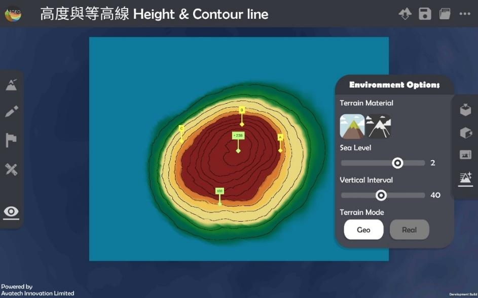

c. 利用已預設的高程點及其他等高線指示，找出A點、B點和C點的高度。

d. 老師可以再塑造更多地形教導學生。

課題二: 地形 Relief
以下示範如何以 ARGEO Portable 教導地形單元。

a. 選擇一個「預設地形 (Preset Terrain) |presetterrain| 」，並選擇想教授的地形。

.. image:: control_images/relief1.png
  :width: 400
  :alt: Alternative text

b. 使用「俯視角度 |topview|」功能觀察地形的等高線。

.. image:: control_images/relief2.jpg
  :width: 400
  :alt: Alternative text

c. 選擇「觀察模式 |viewmode|」調校視角以觀察地形。

d. 選擇「橫切面 |cross_section|」功能，並以滑標調校橫切面至合適的位置。

.. image:: control_images/relief4.jpg
  :width: 400
  :alt: Alternative text

e. 可調校垂直誇大率觀察橫切面圖。

.. image:: control_images/relief5.jpg
  :width: 400
  :alt: Alternative text

遙距教學使用
-----------------------
Zoom
- 開始分享畫面:
1. 在下方(Android)或右上角(iOS)點選分享，選擇熒幕(Android)/螢幕(iOS) (注意: 用家需要是主持人或被主持人允許才可分享畫面)

.. image:: control_images/zoom1.png
  :width: 400
  :alt: Alternative text

2. 按立即開始(Android)或開始直播(iOS)確認分享

.. image:: control_images/zoom2.png
  :width: 400
  :alt: Alternative text

3. 成功分享用家裝置的畫面 (注意: 開始分享後所有參與者都能看見畫面的所有資訊，包括通知及其他程式的畫面 若有不希望公開的資訊請預先更改設定或避免在分享畫面期間打開檢視內容) (Android用家注意: 開始分享後會跳到裝置主畫面)

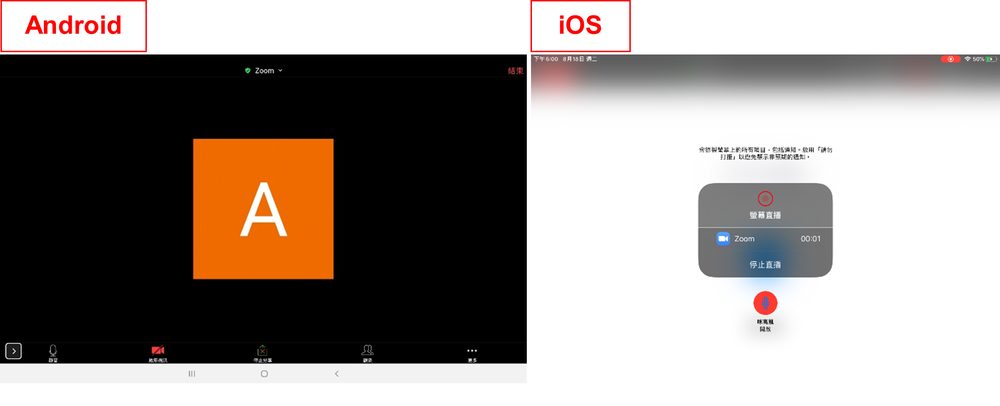

4. 按主目錄鍵離開Zoom但不要關閉應用程式，開啟ARGEO Portable 的程式便可開始教學

- 停止分享畫面:
  教學結束後退出ARGEO Portable
  Android: 返回Zoom點選下方的停止直播/左下方的工具欄停止分享
  iOS: 返回Zoom點選畫面中心的停止直播/在控制中心結束直播

.. image:: control_images/zoom4.png
  :width: 400
  :alt: Alternative text

Google Meet
- 開始分享畫面:
1. 按右上角選項，點選顯示畫面(Android)或分享螢幕畫面(iOS)

.. image:: control_images/googlemeet1.png
  :width: 400
  :alt: Alternative text

2. 按開始顯示再按立即開始(Android)/開始直播(iOS)確認分享

.. image:: control_images/googlemeet2.png
  :width: 400
  :alt: Alternative text

3. 成功分享用家裝置的畫面 (注意: 開始分享後所有參與者都能看見畫面的所有資訊，包括通知及其他程式的畫面 若有不希望公開的資訊請預先更改設定或避免在分享畫面期間打開檢視內容)

.. image:: control_images/googlemeet3.png
  :width: 400
  :alt: Alternative text

4. 按主目錄鍵離開Meet但不要關閉程式，開啟ARGEO Portable 的程式便可開始教學

- 停止分享畫面:
  教學結束後退出ARGEO Portable
  Android: 返回Meet點選畫面中心的停止顯示
  iOS: 返回Meet點選畫面中心的停止直播/在控制中心結束直播

.. image:: control_images/googlemeet4.png
  :width: 400
  :alt: Alternative text

Microsoft Teams

- 開始分享畫面:
1. 按下方的選項，點選分享

.. image:: control_images/microsoftteams1.png
  :width: 400
  :alt: Alternative text

2. 選擇分享螢幕畫面

.. image:: control_images/microsoftteams2.png
  :width: 400
  :alt: Alternative text

3. 按立即開始(Android)或開始直播(iOS)確認分享

.. image:: control_images/microsoftteams3.png
  :width: 400
  :alt: Alternative text

4. 成功分享用家裝置的畫面 (注意: 開始分享後所有參與者都能看見畫面的所有資訊，包括通知及其他程式的畫面 若有不希望公開的資訊請預先更改設定或避免在分享畫面期間打開檢視內容)

.. image:: control_images/microsoftteams4.png
  :width: 400
  :alt: Alternative text

5. 按主目錄鍵離開Teams但不要關閉程式，開啟ARGEO Portable 的程式便可開始教學

- 停止分享畫面:
  教學結束後退出ARGEO Portable
  Android: 返回Teams點選下方的停止簡報
  iOS: 返回Teams點選畫面中心的停止直播/在控制中心結束直播

.. image:: control_images/microsoftteams5.png
  :width: 400
  :alt: Alternative text

