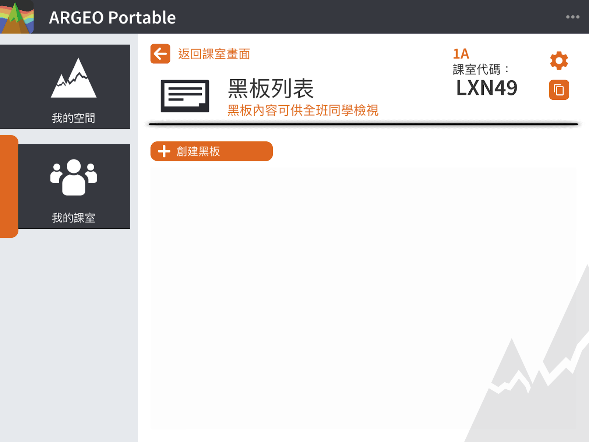
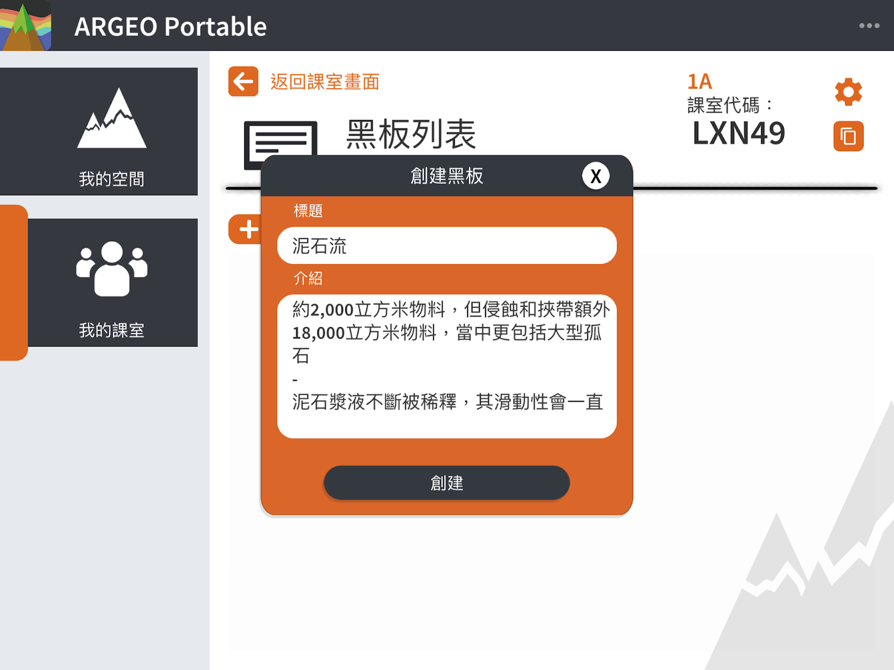

My Class
===================================

My Class Features
-----------------------
"My Class" allows the teacher to create a class, create a blackboard (notes) and assignments in the class, and then assign student accounts to view the blackboard and work on the assignments. At the same time, the teacher can view the assignments and My Space of the students in the class. Teachers can create multiple classes and assign different students to different classes, and student accounts can be added to multiple classes at the same time. Each teacher account can view all the boards and assignments belonging to the licensed class, while student accounts can only view the boards and assignments of the classes they have joined.

Teacher Account
-----------------------
Create Class

Click the [+Create Class] button.

.. image:: myclass_images/teacheracc1.png
  :width: 400
  :alt: Alternative text

Input class name: in Chinese, English or numbers

.. image:: myclass_images/teacheracc2.png
  :width: 400
  :alt: Alternative text

Arrive at the main screen of the class after successful creation.

.. image:: myclass_images/teacheracc3.png
  :width: 400
  :alt: Alternative text

Invite students to join the class
-----------------------
After creating a class, the interface will show the class invitation code, send the code to the students to enter, and the students will be able to join the class. 
For more information: My Classes - Student Account - Join a Class

.. image:: myclass_images/invitestudent.png
  :width: 400
  :alt: Alternative text

Class Management
-----------------------
Click the "Settings" button next to the class name to open the class management interface. In Class Management: You can
   → Change the class name
   → Re-generate the class invitation code
   → View the list of students in the class
   → Remove a student from the class (all the student's workspace will be removed after the student is removed from the class)
   → Remove the class (all the space on the blackboard and workspace (both teacher and students) in the class will be removed)

Class Functions
-----------------------
Blackboard

Blackboard Functions Introduction
Blackboard is a space for the teacher to create for students to view in the class. Students can only view but not edit the blackboard space.

Create Blackboard
Click [+Create Blackboard]

Enter the title (required) and content of the board.

Clicking [Create] will automatically enter the space and you can edit it.

.. image:: myclass_images/blackboard3.png
  :width: 400
  :alt: Alternative text

Editing the blackboard
The function of editing the blackboard is the same as editing My Space, please refer to My Space - Edit My Space for details

Remove the blackboard
Click [...] to open the menu. Open the menu and click the [Delete] button 
   → When the board is removed, teachers and students in the class will no longer be able to view or edit the board.

.. image:: myclass_images/removeblackboard.png
  :width: 400
  :alt: Alternative text

Assignment
-----------------------
Introduction to Assignments
"Assignments" allows teachers to create a space for students to do assignments. Teachers can create an assignment space first, then write the title and requirements in the space information, and edit the starting space for the assignment in advance. When the teacher chooses to publish the assignment, students in the class will be able to view the new assignment, and the starting space in the assignment is the one that the teacher has edited for the assignment in advance.

Note that when the teacher posts an assignment, the teacher can only edit the information in the workspace, not the contents of the workspace (e.g., terrain, icons, etc.).

Students can edit their workspace. Each student's work will be stored in their own account, and the teacher will be able to view all the students' work in the class after they have completed their work, but they cannot edit it.

The teacher can change the status of the assignment to "Unpublished" after publishing the assignment, so that students can no longer view or edit the assignment, but the teacher can still view the students' space in the assignment.

Creating Assignments
Click [+Create Assignment].

.. image:: myclass_images/createhw1.png
  :width: 400
  :alt: Alternative text

Enter the title (required) and content of the assignment.

.. image:: myclass_images/createhw2.png
  :width: 400
  :alt: Alternative text

Click [Create] and you will automatically enter the space where you can edit the starting space of your assignment.

.. image:: myclass_images/createhw3.png
  :width: 400
  :alt: Alternative text

Distribute the assignment
Click [Distribute] to distribute the assignment.

.. image:: myclass_images/assignhw1.png
  :width: 400
  :alt: Alternative text

You can view the assigned assignments from the [Assigned] menu.

.. image:: myclass_images/assignhw2.png
  :width: 400
  :alt: Alternative text

Student Account
-----------------------
Join a new class

Click [+Join Class] and enter the class invitation code.

.. image:: myclass_images/studentacc1.png
  :width: 400
  :alt: Alternative text

After successfully joining the class, you will arrive at the main screen of the class.

.. image:: myclass_images/studentacc2.png
  :width: 400
  :alt: Alternative text

View Blackboard and Assignments

.. image:: myclass_images/studentacc3.png
  :width: 400
  :alt: Alternative text

.. image:: myclass_images/studentacc4.png
  :width: 400
  :alt: Alternative text

