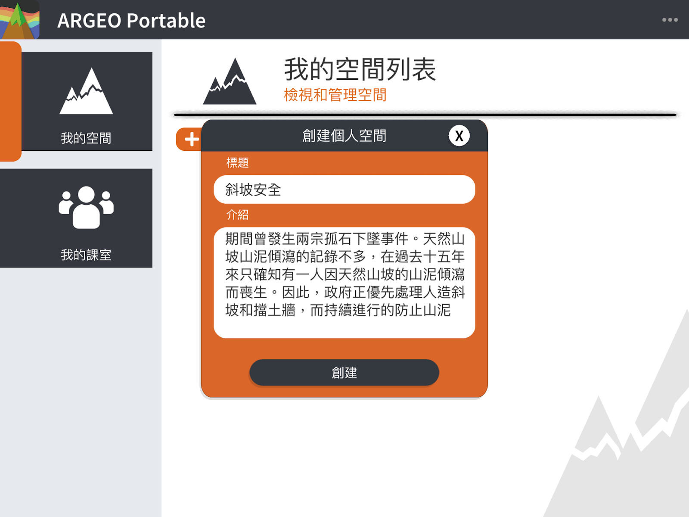
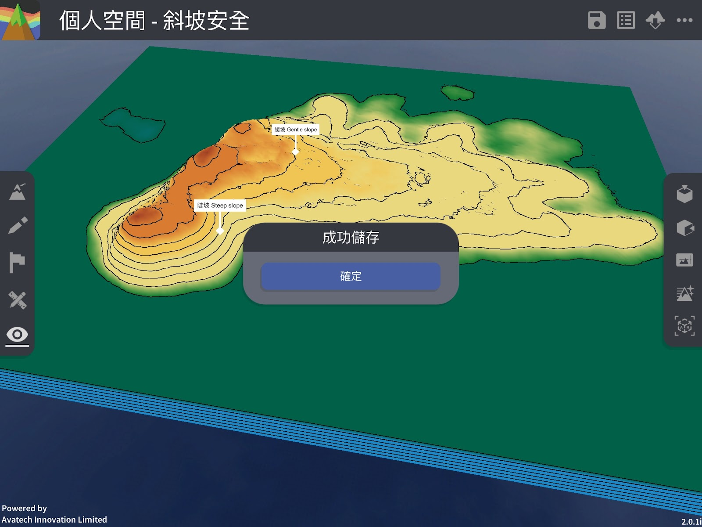

My Space
===================================

My Space Features

"My Space" allows users to create a personalised terrain space where you can use all the editing features, including terrain shaping, drawing tools, marking tools, and the map interface, etc. The space will be saved in your account. Teacher accounts can view the My Spaces of the students in their license class, but cannot edit the students' spaces. Teacher or student accounts cannot view another teacher's My Space, even if the accounts are under the same license. Student accounts must be enrolled in a class to use My Space.

Create My Space
-----------------------
Click the "＋Create Space" button.

.. image:: myspace_images/myspace.png
  :width: 400
  :alt: Alternative text

Input Title (required) and Content

Click [Create] and you will automatically enter the space, from which you can edit.

Edit my space (save, view or edit space information) 
-----------------------
After terrain editing, you can click the "Save" button to save your space. You can also click the "Info" button to view or edit the space information.

.. image:: myspace_images/myspace3.jpg
  :width: 400
  :alt: Alternative text

Storage Space

View or edit space information

.. image:: myspace_images/myspace5.jpg
  :width: 400
  :alt: Alternative text

Exit My Space
-----------------------
Click the [...] button at the top right to open the menu, and click [Exit] in the menu.

.. image:: myspace_images/myspace6.png
  :width: 400
  :alt: Alternative text

Remove my space 
-----------------------
Click [...]. Open the menu and click the [Delete] button.

