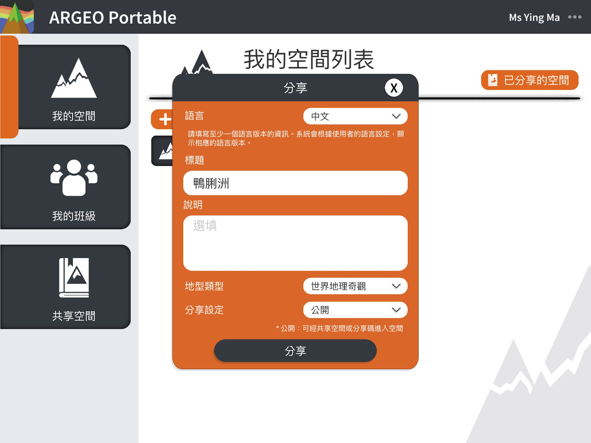

Shared Space
===================================

Introduction to the Shared Space feature
-----------------------
Shared space function allows users to share their own space with other users, so that other users can view the space and get a copy of the space for modification, thus achieving the concept of shared space.

.. image:: sharespace_images/sharespace.png
  :width: 400
  :alt: Alternative text

Share a space
-----------------------
In [My Space], select a space you want to share, and click the [...] button on that space. Open the menu and click [Share].

Enter information about the space: title, description. Since users in different languages may be able to view your space, you can fill in the space information in different languages so that users in different languages can understand your space.

.. image:: sharespace_images/sharespace3.png
  :width: 400
  :alt: Alternative text

Category: Please select an appropriate category.

Sharing Settings: You can choose to share your space in [Open] or [Closed] format 
＊Open: you can enter the space via shared space or sharing code 
＊Closed: you can enter the space with sharing code only.

Note: After you share a space, you can no longer modify the terrain of the shared space, you can only modify the information of the space, and the shared space will not affect the space in [My Space], that is, you can still edit the space in [My Space], but if you want to update the terrain of the space you have already shared, you have to edit the terrain in [My Space], and then re-share it.

Sharing code
-----------------------
After sharing, the system will display a sharing code, you can pass the code to other users, they can directly view the shared space.

.. image:: sharespace_images/sharespace4.png
  :width: 400
  :alt: Alternative text

Click [Enter code].

Input Share Code

Manage my space
-----------------------
After you have shared your space, you can manage your shared space, including viewing the code, editing the information, deleting the space, and so on. 
In [My Space], click [Shared Space].

.. image:: sharespace_images/sharespace7.png
  :width: 400
  :alt: Alternative text

.. image:: sharespace_images/sharespace8.png
  :width: 400
  :alt: Alternative text

＊If you delete a shared space, other users will no longer be able to view your space in the shared space or use the sharing code, and deleting a shared space will not affect the space in [My Space].